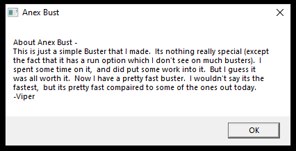
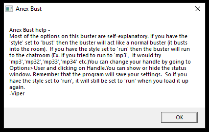
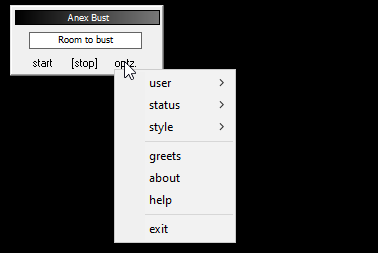
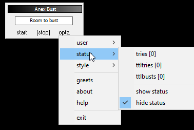
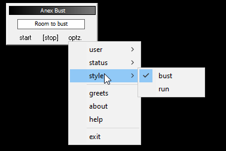
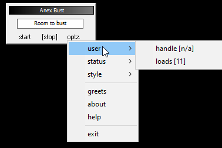
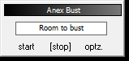

# anexbust

The catalog metadata and filename do not identify a confident single function yet. These need readme/source review or isolated inspection. Filename/catalog cues suggest: room buster vocabulary.

**Safety note:** Historical preservation note: unknown binaries should only be inspected in an isolated vintage VM or emulator.

## Metadata

| Field | Value |
| --- | --- |
| Archive ID | prog-0092-anexbust |
| Catalog number | 92 |
| Name | anexbust |
| Author | going |
| Platform | AOL |
| AOL/version bucket | AOL 4.0 |
| Prog type | Unknown / needs review |
| Category | uncategorized |
| Visual Basic | VB6 |
| Compile type | native |
| Duplicate count | 2 |
| Archive password metadata | not recorded |
| Download status | ready |
| Local mirrored size | 1.3 MB |

## Tags

[#aol](../../../tags/aol.md) [#aol-4-0](../../../tags/aol-4-0.md) [#compile-native](../../../tags/compile-native.md) [#duplicate-metadata](../../../tags/duplicate-metadata.md) [#file-ready](../../../tags/file-ready.md) [#has-screenshots](../../../tags/has-screenshots.md) [#uncategorized](../../../tags/uncategorized.md) [#vb6](../../../tags/vb6.md)

## Source And Files

- Local mirrored archive: [files/aol/aol-4-0/0092-anexbust.zip](../../../../../files/aol/aol-4-0/0092-anexbust.zip)
- Original source path: `programs/AOL/proggies-sorted-deduped/proggies-by-version/4.0/anexbust.zip`
- Source repository URL: [https://github.com/ssstonebraker/aolunderground-proggies/blob/main/programs/AOL/proggies-sorted-deduped/proggies-by-version/4.0/anexbust.zip](https://github.com/ssstonebraker/aolunderground-proggies/blob/main/programs/AOL/proggies-sorted-deduped/proggies-by-version/4.0/anexbust.zip)
- Raw source URL: [https://raw.githubusercontent.com/ssstonebraker/aolunderground-proggies/main/programs/AOL/proggies-sorted-deduped/proggies-by-version/4.0/anexbust.zip](https://raw.githubusercontent.com/ssstonebraker/aolunderground-proggies/main/programs/AOL/proggies-sorted-deduped/proggies-by-version/4.0/anexbust.zip)

## AOL Version Context

The catalog places this entry in the **AOL 4.0** bucket. That is an archive/source classification and should be treated as a best available clue, not a guaranteed compatibility statement.

## Screenshots

### Screenshot 1

- Local/reference path: [assets/screenshots/programsaolproggies-sorted-deduped4-0anexbustscreen-about.png](../../../../../assets/screenshots/programsaolproggies-sorted-deduped4-0anexbustscreen-about.png)
- Source: [https://github.com/ssstonebraker/aolunderground-proggies/blob/main/programs/AOL/proggies-sorted-deduped/4.0/anexbust/screen_about.png](https://github.com/ssstonebraker/aolunderground-proggies/blob/main/programs/AOL/proggies-sorted-deduped/4.0/anexbust/screen_about.png)
### Screenshot 2

- Local/reference path: [assets/screenshots/programsaolproggies-sorted-deduped4-0anexbustscreen-help.png](../../../../../assets/screenshots/programsaolproggies-sorted-deduped4-0anexbustscreen-help.png)
- Source: [https://github.com/ssstonebraker/aolunderground-proggies/blob/main/programs/AOL/proggies-sorted-deduped/4.0/anexbust/screen_help.png](https://github.com/ssstonebraker/aolunderground-proggies/blob/main/programs/AOL/proggies-sorted-deduped/4.0/anexbust/screen_help.png)
### Screenshot 3

- Local/reference path: [assets/screenshots/programsaolproggies-sorted-deduped4-0anexbustscreen-menu.png](../../../../../assets/screenshots/programsaolproggies-sorted-deduped4-0anexbustscreen-menu.png)
- Source: [https://github.com/ssstonebraker/aolunderground-proggies/blob/main/programs/AOL/proggies-sorted-deduped/4.0/anexbust/screen_menu.png](https://github.com/ssstonebraker/aolunderground-proggies/blob/main/programs/AOL/proggies-sorted-deduped/4.0/anexbust/screen_menu.png)
### Screenshot 4

- Local/reference path: [assets/screenshots/programsaolproggies-sorted-deduped4-0anexbustscreen-submenu-status.png](../../../../../assets/screenshots/programsaolproggies-sorted-deduped4-0anexbustscreen-submenu-status.png)
- Source: [https://github.com/ssstonebraker/aolunderground-proggies/blob/main/programs/AOL/proggies-sorted-deduped/4.0/anexbust/screen_submenu_status.png](https://github.com/ssstonebraker/aolunderground-proggies/blob/main/programs/AOL/proggies-sorted-deduped/4.0/anexbust/screen_submenu_status.png)
### Screenshot 5

- Local/reference path: [assets/screenshots/programsaolproggies-sorted-deduped4-0anexbustscreen-submenu-style.png](../../../../../assets/screenshots/programsaolproggies-sorted-deduped4-0anexbustscreen-submenu-style.png)
- Source: [https://github.com/ssstonebraker/aolunderground-proggies/blob/main/programs/AOL/proggies-sorted-deduped/4.0/anexbust/screen_submenu_style.png](https://github.com/ssstonebraker/aolunderground-proggies/blob/main/programs/AOL/proggies-sorted-deduped/4.0/anexbust/screen_submenu_style.png)
### Screenshot 6

- Local/reference path: [assets/screenshots/programsaolproggies-sorted-deduped4-0anexbustscreen-submenu-user.png](../../../../../assets/screenshots/programsaolproggies-sorted-deduped4-0anexbustscreen-submenu-user.png)
- Source: [https://github.com/ssstonebraker/aolunderground-proggies/blob/main/programs/AOL/proggies-sorted-deduped/4.0/anexbust/screen_submenu_user.png](https://github.com/ssstonebraker/aolunderground-proggies/blob/main/programs/AOL/proggies-sorted-deduped/4.0/anexbust/screen_submenu_user.png)
### Screenshot 7

- Local/reference path: [assets/screenshots/programsaolproggies-sorted-deduped4-0anexbustscreenshot.png](../../../../../assets/screenshots/programsaolproggies-sorted-deduped4-0anexbustscreenshot.png)
- Source: [https://github.com/ssstonebraker/aolunderground-proggies/blob/main/programs/AOL/proggies-sorted-deduped/4.0/anexbust/screenshot.png](https://github.com/ssstonebraker/aolunderground-proggies/blob/main/programs/AOL/proggies-sorted-deduped/4.0/anexbust/screenshot.png)

## Embedded Or Original URLs

No readable original URLs were found inside the mirrored archive text during the current scan.

## Related Indexes

- Category: [uncategorized](../../../categories/uncategorized.md)
- Version bucket: [AOL 4.0](../../../versions/aol-4-0.md)
- Applications index: [all applications](../../all-applications.md)
