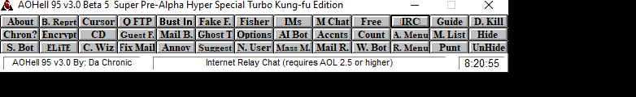
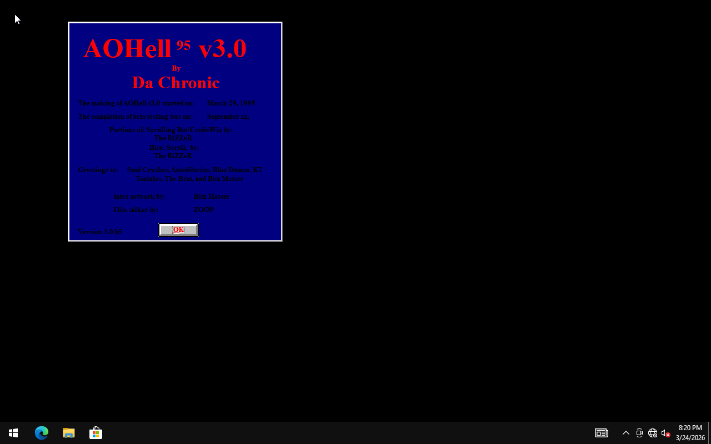
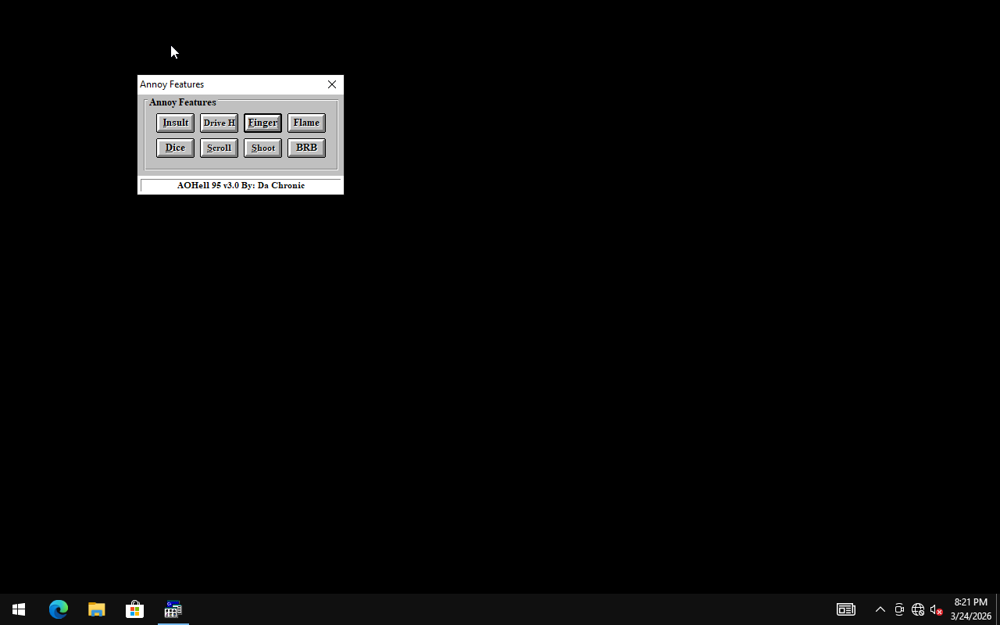
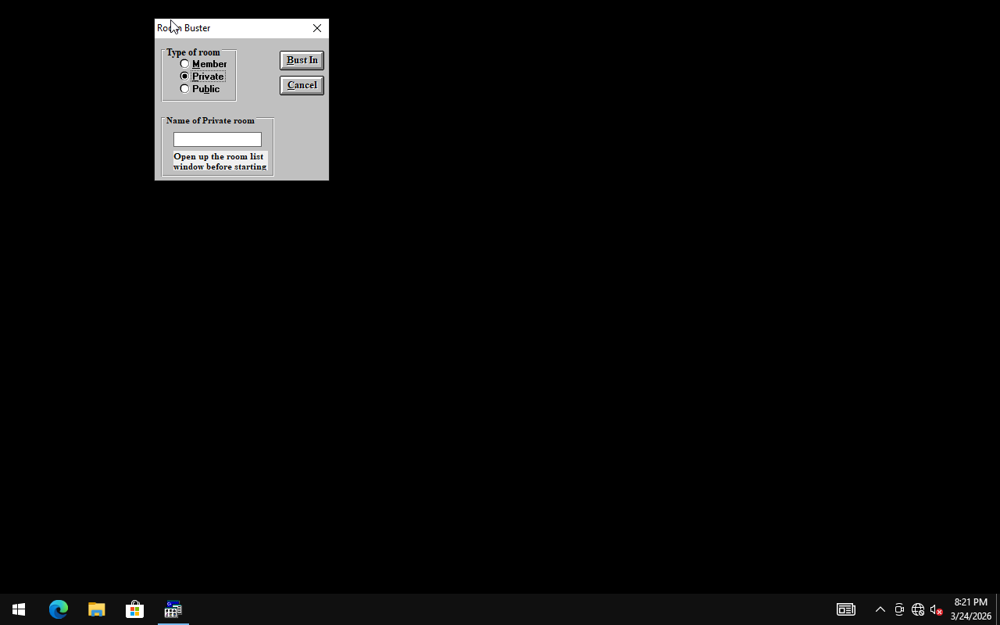
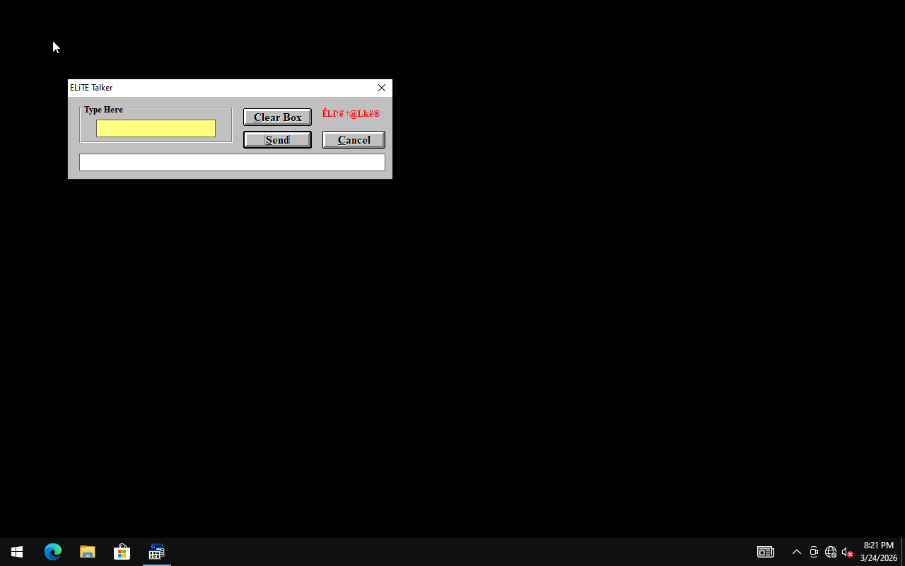
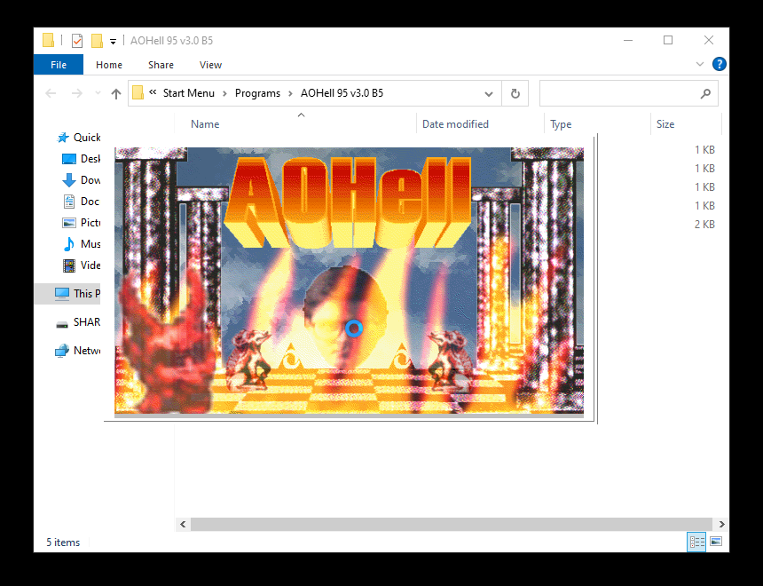
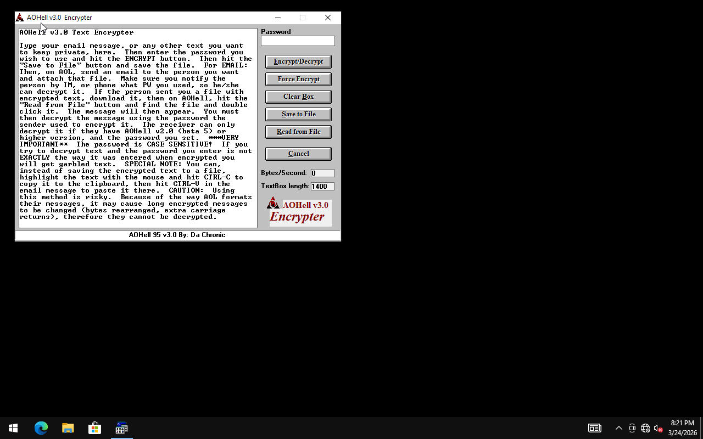
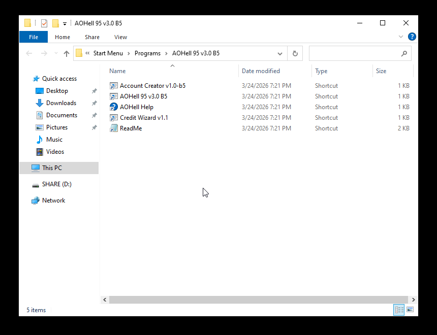

# AOHell 95 v3.0

A bundled AOL-era utility suite. These often mixed chat tools, idlers, faders, linkers, file helpers, and other scene features in one interface.

**Safety note:** Historical preservation note: unknown binaries should only be inspected in an isolated vintage VM or emulator.

## Metadata

| Field | Value |
| --- | --- |
| Archive ID | prog-0128-aohell-95-v3-0 |
| Catalog number | 128 |
| Name | AOHell 95 v3.0 |
| Author | Da Chronic |
| Platform | AOL |
| AOL/version bucket | AOL 2.5 |
| Prog type | All-in-one prog suite |
| Category | all-in-one prog |
| Visual Basic | VB3 |
| Compile type | unknown |
| Duplicate count | 4 |
| Archive password metadata | not recorded |
| Download status | ready |
| Local mirrored size | 1.1 MB |

## Tags

[#all-in-one-prog](../../../tags/all-in-one-prog.md) [#aol](../../../tags/aol.md) [#aol-2-5](../../../tags/aol-2-5.md) [#duplicate-metadata](../../../tags/duplicate-metadata.md) [#file-ready](../../../tags/file-ready.md) [#has-screenshots](../../../tags/has-screenshots.md) [#vb3](../../../tags/vb3.md)

## Source And Files

- Local mirrored archive: [files/aol/aol-2-5/0128-aohell-95-v3-0.zip](../../../../../files/aol/aol-2-5/0128-aohell-95-v3-0.zip)
- Original source path: `programs/AOL/proggies-sorted-deduped/proggies-by-version/2.5/aohell 95 for aol 2.5-3.0.zip`
- Source repository URL: [https://github.com/ssstonebraker/aolunderground-proggies/blob/main/programs/AOL/proggies-sorted-deduped/proggies-by-version/2.5/aohell%2095%20for%20aol%202.5-3.0.zip](https://github.com/ssstonebraker/aolunderground-proggies/blob/main/programs/AOL/proggies-sorted-deduped/proggies-by-version/2.5/aohell%2095%20for%20aol%202.5-3.0.zip)
- Raw source URL: [https://raw.githubusercontent.com/ssstonebraker/aolunderground-proggies/main/programs/AOL/proggies-sorted-deduped/proggies-by-version/2.5/aohell%2095%20for%20aol%202.5-3.0.zip](https://raw.githubusercontent.com/ssstonebraker/aolunderground-proggies/main/programs/AOL/proggies-sorted-deduped/proggies-by-version/2.5/aohell%2095%20for%20aol%202.5-3.0.zip)

## AOL Version Context

The catalog places this entry in the **AOL 2.5** bucket. That is an archive/source classification and should be treated as a best available clue, not a guaranteed compatibility statement.

## Screenshots

### Screenshot 1

- Local/reference path: [assets/screenshots/programsaolproggies-sorted-deduped2-5aohell-95-for-aol-2-5-3-0main-form.png](../../../../../assets/screenshots/programsaolproggies-sorted-deduped2-5aohell-95-for-aol-2-5-3-0main-form.png)
- Source: [https://github.com/ssstonebraker/aolunderground-proggies/blob/main/programs/AOL/proggies-sorted-deduped/2.5/aohell%2095%20for%20aol%202.5-3.0/main_form.png](https://github.com/ssstonebraker/aolunderground-proggies/blob/main/programs/AOL/proggies-sorted-deduped/2.5/aohell%2095%20for%20aol%202.5-3.0/main_form.png)
### Screenshot 2

- Local/reference path: [assets/screenshots/programsaolproggies-sorted-deduped2-5aohell-95-for-aol-2-5-3-0screen-about.png](../../../../../assets/screenshots/programsaolproggies-sorted-deduped2-5aohell-95-for-aol-2-5-3-0screen-about.png)
- Source: [https://github.com/ssstonebraker/aolunderground-proggies/blob/main/programs/AOL/proggies-sorted-deduped/2.5/aohell%2095%20for%20aol%202.5-3.0/screen_about.png](https://github.com/ssstonebraker/aolunderground-proggies/blob/main/programs/AOL/proggies-sorted-deduped/2.5/aohell%2095%20for%20aol%202.5-3.0/screen_about.png)
### Screenshot 3

- Local/reference path: [assets/screenshots/programsaolproggies-sorted-deduped2-5aohell-95-for-aol-2-5-3-0screen-annoy.png](../../../../../assets/screenshots/programsaolproggies-sorted-deduped2-5aohell-95-for-aol-2-5-3-0screen-annoy.png)
- Source: [https://github.com/ssstonebraker/aolunderground-proggies/blob/main/programs/AOL/proggies-sorted-deduped/2.5/aohell%2095%20for%20aol%202.5-3.0/screen_annoy.png](https://github.com/ssstonebraker/aolunderground-proggies/blob/main/programs/AOL/proggies-sorted-deduped/2.5/aohell%2095%20for%20aol%202.5-3.0/screen_annoy.png)
### Screenshot 4

- Local/reference path: [assets/screenshots/programsaolproggies-sorted-deduped2-5aohell-95-for-aol-2-5-3-0screen-bust-in.png](../../../../../assets/screenshots/programsaolproggies-sorted-deduped2-5aohell-95-for-aol-2-5-3-0screen-bust-in.png)
- Source: [https://github.com/ssstonebraker/aolunderground-proggies/blob/main/programs/AOL/proggies-sorted-deduped/2.5/aohell%2095%20for%20aol%202.5-3.0/screen_bust_in.png](https://github.com/ssstonebraker/aolunderground-proggies/blob/main/programs/AOL/proggies-sorted-deduped/2.5/aohell%2095%20for%20aol%202.5-3.0/screen_bust_in.png)
### Screenshot 5

- Local/reference path: [assets/screenshots/programsaolproggies-sorted-deduped2-5aohell-95-for-aol-2-5-3-0screen-elite.png](../../../../../assets/screenshots/programsaolproggies-sorted-deduped2-5aohell-95-for-aol-2-5-3-0screen-elite.png)
- Source: [https://github.com/ssstonebraker/aolunderground-proggies/blob/main/programs/AOL/proggies-sorted-deduped/2.5/aohell%2095%20for%20aol%202.5-3.0/screen_elite.png](https://github.com/ssstonebraker/aolunderground-proggies/blob/main/programs/AOL/proggies-sorted-deduped/2.5/aohell%2095%20for%20aol%202.5-3.0/screen_elite.png)
### Screenshot 6

- Local/reference path: [assets/screenshots/programsaolproggies-sorted-deduped2-5aohell-95-for-aol-2-5-3-0screen-email-bomb.png](../../../../../assets/screenshots/programsaolproggies-sorted-deduped2-5aohell-95-for-aol-2-5-3-0screen-email-bomb.png)
- Source: [https://github.com/ssstonebraker/aolunderground-proggies/blob/main/programs/AOL/proggies-sorted-deduped/2.5/aohell%2095%20for%20aol%202.5-3.0/screen_email_bomb.png](https://github.com/ssstonebraker/aolunderground-proggies/blob/main/programs/AOL/proggies-sorted-deduped/2.5/aohell%2095%20for%20aol%202.5-3.0/screen_email_bomb.png)
### Screenshot 7

- Local/reference path: [assets/screenshots/programsaolproggies-sorted-deduped2-5aohell-95-for-aol-2-5-3-0screen-encrypt.png](../../../../../assets/screenshots/programsaolproggies-sorted-deduped2-5aohell-95-for-aol-2-5-3-0screen-encrypt.png)
- Source: [https://github.com/ssstonebraker/aolunderground-proggies/blob/main/programs/AOL/proggies-sorted-deduped/2.5/aohell%2095%20for%20aol%202.5-3.0/screen_encrypt.png](https://github.com/ssstonebraker/aolunderground-proggies/blob/main/programs/AOL/proggies-sorted-deduped/2.5/aohell%2095%20for%20aol%202.5-3.0/screen_encrypt.png)
### Screenshot 8

- Local/reference path: [assets/screenshots/programsaolproggies-sorted-deduped2-5aohell-95-for-aol-2-5-3-0screen-fake-forward.png](../../../../../assets/screenshots/programsaolproggies-sorted-deduped2-5aohell-95-for-aol-2-5-3-0screen-fake-forward.png)
- Source: [https://github.com/ssstonebraker/aolunderground-proggies/blob/main/programs/AOL/proggies-sorted-deduped/2.5/aohell%2095%20for%20aol%202.5-3.0/screen_fake_forward.png](https://github.com/ssstonebraker/aolunderground-proggies/blob/main/programs/AOL/proggies-sorted-deduped/2.5/aohell%2095%20for%20aol%202.5-3.0/screen_fake_forward.png)

## Embedded Or Original URLs

No readable original URLs were found inside the mirrored archive text during the current scan.

## Related Indexes

- Category: [all-in-one prog](../../../categories/all-in-one-prog.md)
- Version bucket: [AOL 2.5](../../../versions/aol-2-5.md)
- Applications index: [all applications](../../all-applications.md)
