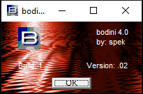
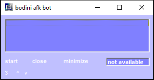
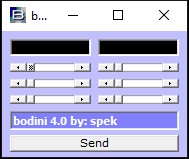
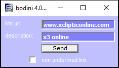
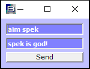

# bodini

The catalog metadata and filename do not identify a confident single function yet. These need readme/source review or isolated inspection. Readable archive text also suggests: Mass mailer / server, Media / file utility.

**Safety note:** Historical preservation note: unknown binaries should only be inspected in an isolated vintage VM or emulator.

## Metadata

| Field | Value |
| --- | --- |
| Archive ID | prog-0283-bodini |
| Catalog number | 283 |
| Best known name | bodini |
| Best name source | catalog |
| Catalog label | bodini |
| Archive filename | bodini.zip |
| File size | 4.2 MB |
| Author | spek |
| Catalog author | spek |
| Manual author evidence | unknown |
| Archive-text author | unknown |
| Inferred author | unknown |
| Author conflict note | none |
| Platform | AOL |
| AOL/version bucket | AOL 4.0 |
| Catalog AOL/version bucket | AOL 4.0 |
| Inferred AOL version | unknown |
| Archive-text AOL/version mentions | unknown |
| External ZIP text version mentions | unknown |
| Prog type | Mass mailer / server |
| Category | uncategorized |
| Manual purpose clues | unknown |
| Archive-text purpose clues | Mass mailer / server, Media / file utility |
| External ZIP text purpose clues | unknown |
| Archive text files reviewed | readme.txt phatprogz.txt |
| Matched external ZIP text evidence | 0 |
| Visual Basic | VB6 |
| Compile type | native |
| Duplicate count | 2 |
| Archive password metadata | not recorded |
| Download status | ready |
| Local mirrored size | 4.2 MB |
| Matched web download links | 1 |
| Matched mirror leads | 1 |
| Web research mentions | 0 |
| Web image leads | 0 |

## Tags

[#aol](../../../tags/aol.md) [#aol-4-0](../../../tags/aol-4-0.md) [#compile-native](../../../tags/compile-native.md) [#duplicate-metadata](../../../tags/duplicate-metadata.md) [#file-ready](../../../tags/file-ready.md) [#has-embedded-urls](../../../tags/has-embedded-urls.md) [#has-old-web-downloads](../../../tags/has-old-web-downloads.md) [#has-readme-purpose-clues](../../../tags/has-readme-purpose-clues.md) [#has-screenshots](../../../tags/has-screenshots.md) [#uncategorized](../../../tags/uncategorized.md) [#vb6](../../../tags/vb6.md)

## Source And Files

- Local mirrored archive: [files/aol/aol-4-0/0283-bodini.zip](../../../../../files/aol/aol-4-0/0283-bodini.zip)
- Old-web / Wayback download leads: 1 link(s) listed below
- Matched mirror leads: 1 link(s) listed below
- Catalog reference path: `programs/AOL/proggies-sorted-deduped/proggies-by-version/4.0/bodini.zip`
- Reference repository mirror page: [https://github.com/ssstonebraker/aolunderground-proggies/blob/main/programs/AOL/proggies-sorted-deduped/proggies-by-version/4.0/bodini.zip](https://github.com/ssstonebraker/aolunderground-proggies/blob/main/programs/AOL/proggies-sorted-deduped/proggies-by-version/4.0/bodini.zip)
- Reference repository raw mirror: [https://raw.githubusercontent.com/ssstonebraker/aolunderground-proggies/main/programs/AOL/proggies-sorted-deduped/proggies-by-version/4.0/bodini.zip](https://raw.githubusercontent.com/ssstonebraker/aolunderground-proggies/main/programs/AOL/proggies-sorted-deduped/proggies-by-version/4.0/bodini.zip)

## AOL Version Context

The catalog places this entry in the **AOL 4.0** bucket. That is an archive/source classification and should be treated as a best available clue, not a guaranteed compatibility statement.

## Screenshots

### Screenshot 1

- Local/reference path: [assets/screenshots/programsaolproggies-sorted-deduped4-0bodinimain-form.png](../../../../../assets/screenshots/programsaolproggies-sorted-deduped4-0bodinimain-form.png)
- Source: [https://github.com/ssstonebraker/aolunderground-proggies/blob/main/programs/AOL/proggies-sorted-deduped/4.0/bodini/main_form.png](https://github.com/ssstonebraker/aolunderground-proggies/blob/main/programs/AOL/proggies-sorted-deduped/4.0/bodini/main_form.png)
### Screenshot 2

- Local/reference path: [assets/screenshots/programsaolproggies-sorted-deduped4-0bodiniscreen-8-ball-bot.png](../../../../../assets/screenshots/programsaolproggies-sorted-deduped4-0bodiniscreen-8-ball-bot.png)
- Source: [https://github.com/ssstonebraker/aolunderground-proggies/blob/main/programs/AOL/proggies-sorted-deduped/4.0/bodini/screen_8-ball_bot.png](https://github.com/ssstonebraker/aolunderground-proggies/blob/main/programs/AOL/proggies-sorted-deduped/4.0/bodini/screen_8-ball_bot.png)
### Screenshot 3

- Local/reference path: [assets/screenshots/programsaolproggies-sorted-deduped4-0bodiniscreen-about.png](../../../../../assets/screenshots/programsaolproggies-sorted-deduped4-0bodiniscreen-about.png)
- Source: [https://github.com/ssstonebraker/aolunderground-proggies/blob/main/programs/AOL/proggies-sorted-deduped/4.0/bodini/screen_about.png](https://github.com/ssstonebraker/aolunderground-proggies/blob/main/programs/AOL/proggies-sorted-deduped/4.0/bodini/screen_about.png)
### Screenshot 4

- Local/reference path: [assets/screenshots/programsaolproggies-sorted-deduped4-0bodiniscreen-afk-bot.png](../../../../../assets/screenshots/programsaolproggies-sorted-deduped4-0bodiniscreen-afk-bot.png)
- Source: [https://github.com/ssstonebraker/aolunderground-proggies/blob/main/programs/AOL/proggies-sorted-deduped/4.0/bodini/screen_afk_bot.png](https://github.com/ssstonebraker/aolunderground-proggies/blob/main/programs/AOL/proggies-sorted-deduped/4.0/bodini/screen_afk_bot.png)
### Screenshot 5

- Local/reference path: [assets/screenshots/programsaolproggies-sorted-deduped4-0bodiniscreen-attention.png](../../../../../assets/screenshots/programsaolproggies-sorted-deduped4-0bodiniscreen-attention.png)
- Source: [https://github.com/ssstonebraker/aolunderground-proggies/blob/main/programs/AOL/proggies-sorted-deduped/4.0/bodini/screen_attention.png](https://github.com/ssstonebraker/aolunderground-proggies/blob/main/programs/AOL/proggies-sorted-deduped/4.0/bodini/screen_attention.png)
### Screenshot 6

- Local/reference path: [assets/screenshots/programsaolproggies-sorted-deduped4-0bodiniscreen-chat-fader.png](../../../../../assets/screenshots/programsaolproggies-sorted-deduped4-0bodiniscreen-chat-fader.png)
- Source: [https://github.com/ssstonebraker/aolunderground-proggies/blob/main/programs/AOL/proggies-sorted-deduped/4.0/bodini/screen_chat_fader.png](https://github.com/ssstonebraker/aolunderground-proggies/blob/main/programs/AOL/proggies-sorted-deduped/4.0/bodini/screen_chat_fader.png)
### Screenshot 7

- Local/reference path: [assets/screenshots/programsaolproggies-sorted-deduped4-0bodiniscreen-chat-link-sender.png](../../../../../assets/screenshots/programsaolproggies-sorted-deduped4-0bodiniscreen-chat-link-sender.png)
- Source: [https://github.com/ssstonebraker/aolunderground-proggies/blob/main/programs/AOL/proggies-sorted-deduped/4.0/bodini/screen_chat_link_sender.png](https://github.com/ssstonebraker/aolunderground-proggies/blob/main/programs/AOL/proggies-sorted-deduped/4.0/bodini/screen_chat_link_sender.png)
### Screenshot 8

- Local/reference path: [assets/screenshots/programsaolproggies-sorted-deduped4-0bodiniscreen-chat-manipulator.png](../../../../../assets/screenshots/programsaolproggies-sorted-deduped4-0bodiniscreen-chat-manipulator.png)
- Source: [https://github.com/ssstonebraker/aolunderground-proggies/blob/main/programs/AOL/proggies-sorted-deduped/4.0/bodini/screen_chat_manipulator.png](https://github.com/ssstonebraker/aolunderground-proggies/blob/main/programs/AOL/proggies-sorted-deduped/4.0/bodini/screen_chat_manipulator.png)

## Embedded Or Original URLs

These URLs were found in safely readable archive text. They are recorded as provenance clues, not as endorsements.

| URL | Found in | Source |
| --- | --- | --- |
| [http://www.xclipticonline.com/spek](http://www.xclipticonline.com/spek) | readme.txt | archive text |
| [http://www.punknboards.com/progs](http://www.punknboards.com/progs) | phatprogz.txt | archive text |

## Web Research

This section connects the catalog entry to old pages, crawled download URLs, mirror lists, and image leads. Matches are evidence, not guaranteed runtime compatibility claims.

### Archive Text Scan

Readable archive text is used as provenance evidence for author, purpose, old URLs, and AOL-version clues. Binaries are not executed.

| Text files reviewed | Author clues | Purpose clues | AOL/version clues | Notes |
| --- | --- | --- | --- | --- |
| readme.txt phatprogz.txt | none | Mass mailer / server Media / file utility | none | readme.txt has vocabulary for Mass mailer / server. phatprogz.txt has vocabulary for Media / file utility. phatprogz.txt includes a mirror/download-source note. |

### Matched External ZIP Text Evidence

No recovered external ZIP text is matched to this entry yet.

### Source Mentions

No specific old-page program mention is matched to this entry yet.

### Matched Web Download Links

These are old-page or recovered download URLs matched by filename/title. They are preserved as provenance and recovery leads.

| Source | Label | URL | Original URL |
| --- | --- | --- | --- |
| prog's/misc a-m | bodini | [https://web.archive.org/web/20110904003253/http://lenshellarchive.com/Progs/aolprogs/bodini.zip](https://web.archive.org/web/20110904003253/http://lenshellarchive.com/Progs/aolprogs/bodini.zip) | [http://lenshellarchive.com/Progs/aolprogs/bodini.zip](http://lenshellarchive.com/Progs/aolprogs/bodini.zip) |

### Mirror Leads

| Source | Label | Original URL | Wayback URL | Local recovered file | Status |
| --- | --- | --- | --- | --- | --- |
| Web page: prog's/misc a-m | bodini.zip | [http://lenshellarchive.com/Progs/aolprogs/bodini.zip](http://lenshellarchive.com/Progs/aolprogs/bodini.zip) | [https://web.archive.org/web/20110904003253/http://lenshellarchive.com/Progs/aolprogs/bodini.zip](https://web.archive.org/web/20110904003253/http://lenshellarchive.com/Progs/aolprogs/bodini.zip) | unknown | http-404 |

### Web Image Leads

No extra web-image leads are matched to this entry yet.

## Related Indexes

- Category: [uncategorized](../../../categories/uncategorized.md)
- Version bucket: [AOL 4.0](../../../versions/aol-4-0.md)
- Applications index: [all applications](../../all-applications.md)
- Download map: [all program download links](../../all-program-downloads.md)
