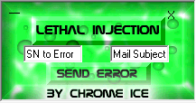

# lethalbyice

The catalog metadata and filename do not identify a confident single function yet. These need readme/source review or isolated inspection.

**Safety note:** Historical preservation note: unknown binaries should only be inspected in an isolated vintage VM or emulator.

## Metadata

| Field | Value |
| --- | --- |
| Archive ID | prog-1125-lethalbyice |
| Catalog number | 1125 |
| Best known name | lethalbyice |
| Best name source | catalog |
| Catalog label | lethalbyice |
| Archive filename | lethalinjection.zip |
| File size | 1.4 MB |
| Author | Chr0me iCe |
| Catalog author | Chr0me iCe |
| Manual author evidence | unknown |
| Archive-text author | unknown |
| Inferred author | unknown |
| Author conflict note | none |
| Platform | AOL |
| AOL/version bucket | AOL 4.0 |
| Catalog AOL/version bucket | AOL 4.0 |
| Inferred AOL version | unknown |
| Archive-text AOL/version mentions | unknown |
| External ZIP text version mentions | unknown |
| Prog type | Unknown / needs review |
| Category | uncategorized |
| Manual purpose clues | unknown |
| Archive-text purpose clues | unknown |
| External ZIP text purpose clues | unknown |
| Archive text files reviewed | none |
| Matched external ZIP text evidence | 0 |
| Visual Basic | VB6 |
| Compile type | p-code |
| Duplicate count | 2 |
| Archive password metadata | not recorded |
| Download status | ready |
| Local mirrored size | 1.4 MB |
| Matched web download links | 1 |
| Matched mirror leads | 0 |
| Web research mentions | 0 |
| Web image leads | 0 |
| Author confidence | catalog only |
| Category confidence | needs review |
| AOL/version confidence | catalog bucket |
| Source confidence | local + old-web lead |
| Manual review flags | category uncertain, type uncertain, no readable text evidence |

## Tags

[#aol](../../../tags/aol.md) [#aol-4-0](../../../tags/aol-4-0.md) [#compile-p-code](../../../tags/compile-p-code.md) [#duplicate-metadata](../../../tags/duplicate-metadata.md) [#file-ready](../../../tags/file-ready.md) [#has-old-web-downloads](../../../tags/has-old-web-downloads.md) [#has-screenshots](../../../tags/has-screenshots.md) [#needs-manual-review](../../../tags/needs-manual-review.md) [#uncategorized](../../../tags/uncategorized.md) [#vb6](../../../tags/vb6.md)

## Source And Files

- Local mirrored archive: [files/aol/aol-4-0/1125-lethalbyice.zip](../../../../../files/aol/aol-4-0/1125-lethalbyice.zip)
- Old-web / Wayback download leads: 1 link(s) listed below
- Catalog reference path: `programs/AOL/proggies-sorted-deduped/proggies-by-version/4.0/lethalinjection.zip`
- Reference repository mirror page: [https://github.com/ssstonebraker/aolunderground-proggies/blob/main/programs/AOL/proggies-sorted-deduped/proggies-by-version/4.0/lethalinjection.zip](https://github.com/ssstonebraker/aolunderground-proggies/blob/main/programs/AOL/proggies-sorted-deduped/proggies-by-version/4.0/lethalinjection.zip)
- Reference repository raw mirror: [https://raw.githubusercontent.com/ssstonebraker/aolunderground-proggies/main/programs/AOL/proggies-sorted-deduped/proggies-by-version/4.0/lethalinjection.zip](https://raw.githubusercontent.com/ssstonebraker/aolunderground-proggies/main/programs/AOL/proggies-sorted-deduped/proggies-by-version/4.0/lethalinjection.zip)

## AOL Version Context

The catalog places this entry in the **AOL 4.0** bucket. That is an archive/source classification and should be treated as a best available clue, not a guaranteed compatibility statement.

## Screenshots

### Screenshot 1

- Local/reference path: [assets/screenshots/programsaolproggies-sorted-deduped4-0lethalinjectionscreenshot.png](../../../../../assets/screenshots/programsaolproggies-sorted-deduped4-0lethalinjectionscreenshot.png)
- Source: [https://github.com/ssstonebraker/aolunderground-proggies/blob/main/programs/AOL/proggies-sorted-deduped/4.0/lethalinjection/screenshot.png](https://github.com/ssstonebraker/aolunderground-proggies/blob/main/programs/AOL/proggies-sorted-deduped/4.0/lethalinjection/screenshot.png)

## Embedded Or Original URLs

No readable original URLs were found inside the mirrored archive text during the current scan.

## Web Research

This section connects the catalog entry to old pages, crawled download URLs, mirror lists, and image leads. Matches are evidence, not guaranteed runtime compatibility claims.

### Archive Text Scan

No readable ReadMe/NFO/source text has been extracted for this entry yet.

### Matched External ZIP Text Evidence

No recovered external ZIP text is matched to this entry yet.

### Source Mentions

No specific old-page program mention is matched to this entry yet.

### Matched Web Download Links

These are old-page or recovered download URLs matched by filename/title. They are preserved as provenance and recovery leads.

| Source | Label | URL | Original URL |
| --- | --- | --- | --- |
| LensHell punters | lethal injection mail error | [https://web.archive.org/web/20110904003420/http://lenshellarchive.com/Progs/aolpunters/lethalinjection.zip](https://web.archive.org/web/20110904003420/http://lenshellarchive.com/Progs/aolpunters/lethalinjection.zip) | [http://lenshellarchive.com/Progs/aolpunters/lethalinjection.zip](http://lenshellarchive.com/Progs/aolpunters/lethalinjection.zip) |

### Mirror Leads

No external mirror leads are matched to this entry yet.

### Web Image Leads

No extra web-image leads are matched to this entry yet.

## Related Indexes

- Category: [uncategorized](../../../categories/uncategorized.md)
- Version bucket: [AOL 4.0](../../../versions/aol-4-0.md)
- Applications index: [all applications](../../all-applications.md)
- Download map: [all program download links](../../all-program-downloads.md)
