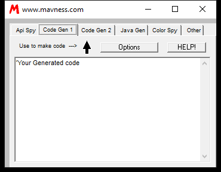
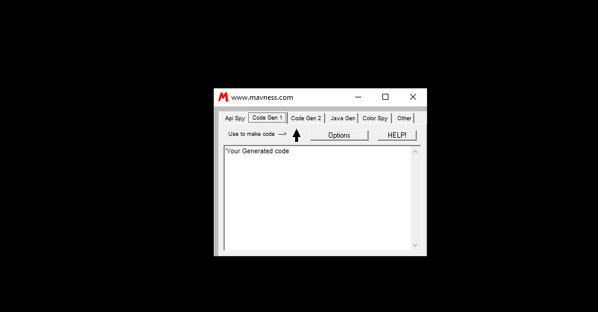
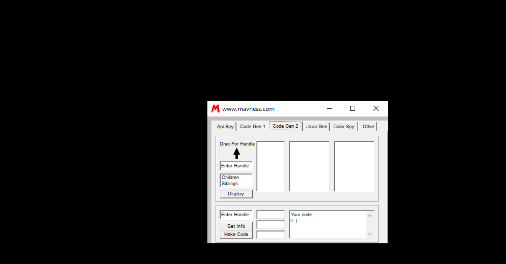
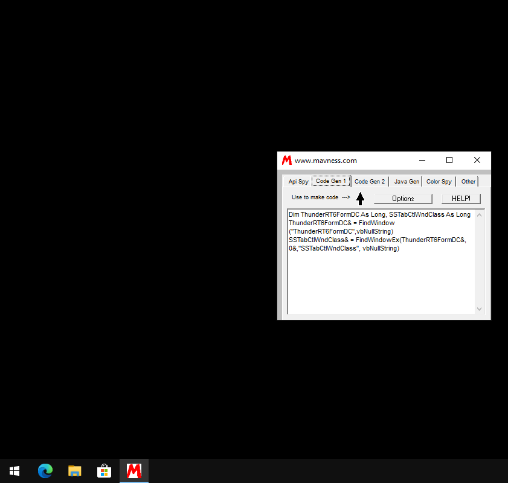
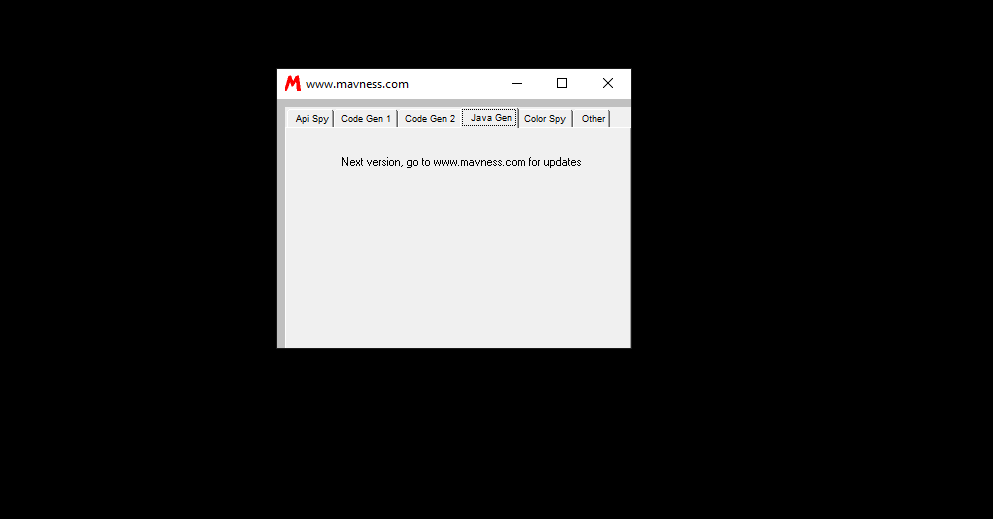
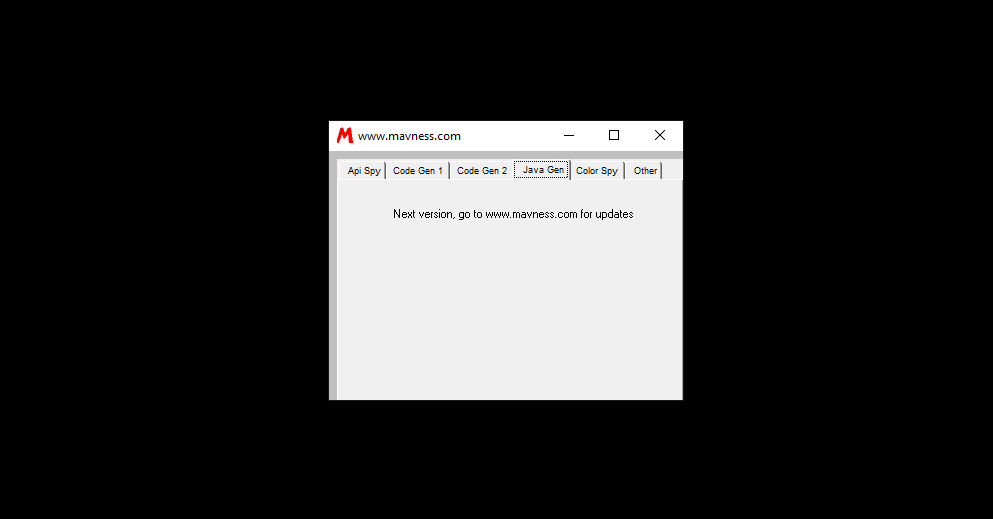
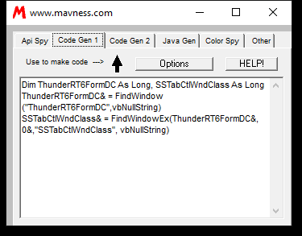

# Mav-Spy 4

Source code, Visual Basic material, controls, modules, tutorials, or development support files.

**Safety note:** Historical preservation note: unknown binaries should only be inspected in an isolated vintage VM or emulator.

## Metadata

| Field | Value |
| --- | --- |
| Archive ID | prog-1234-mav-spy-4 |
| Catalog number | 1234 |
| Best known name | Mav-Spy 4 |
| Best name source | catalog |
| Catalog label | Mav-Spy 4 |
| Archive filename | mav-spy.zip |
| File size | 135 KB |
| Author | Mavness |
| Catalog author | Mavness |
| Manual author evidence | unknown |
| Archive-text author | unknown |
| Inferred author | unknown |
| Author conflict note | none |
| Platform | AOL |
| AOL/version bucket | Tools |
| Catalog AOL/version bucket | Tools |
| Inferred AOL version | unknown |
| Archive-text AOL/version mentions | unknown |
| External ZIP text version mentions | unknown |
| Prog type | All-in-one prog suite |
| Category | development or source |
| Manual purpose clues | unknown |
| Archive-text purpose clues | unknown |
| External ZIP text purpose clues | unknown |
| Archive text files reviewed | none |
| Matched external ZIP text evidence | 0 |
| Visual Basic | VB6 |
| Compile type | unknown |
| Duplicate count | 1 |
| Archive password metadata | not recorded |
| Download status | ready |
| Local mirrored size | 135 KB |
| Matched web download links | 0 |
| Matched mirror leads | 0 |
| Web research mentions | 0 |
| Web image leads | 0 |
| Author confidence | catalog only |
| Category confidence | catalog/path inferred |
| AOL/version confidence | catalog bucket |
| Source confidence | local catalog mirror |
| Manual review flags | no readable text evidence |

## Tags

[#aol](../../../tags/aol.md) [#development-or-source](../../../tags/development-or-source.md) [#duplicate-metadata](../../../tags/duplicate-metadata.md) [#file-ready](../../../tags/file-ready.md) [#has-screenshots](../../../tags/has-screenshots.md) [#needs-manual-review](../../../tags/needs-manual-review.md) [#tools](../../../tags/tools.md) [#vb6](../../../tags/vb6.md)

## Source And Files

- Local mirrored archive: [files/aol/mixed/1234-mav-spy-4.zip](../../../../../files/aol/mixed/1234-mav-spy-4.zip)
- Old-web / Wayback download leads: not matched yet
- Catalog reference path: `programming/vb/Visual-Basic-Tools/mav-spy.zip`
- Reference repository mirror page: [https://github.com/ssstonebraker/aolunderground-proggies/blob/main/programming/vb/Visual-Basic-Tools/mav-spy.zip](https://github.com/ssstonebraker/aolunderground-proggies/blob/main/programming/vb/Visual-Basic-Tools/mav-spy.zip)
- Reference repository raw mirror: [https://raw.githubusercontent.com/ssstonebraker/aolunderground-proggies/main/programming/vb/Visual-Basic-Tools/mav-spy.zip](https://raw.githubusercontent.com/ssstonebraker/aolunderground-proggies/main/programming/vb/Visual-Basic-Tools/mav-spy.zip)

## AOL Version Context

The catalog places this entry in the **Tools** bucket. That is an archive/source classification and should be treated as a best available clue, not a guaranteed compatibility statement.

## Screenshots

### Screenshot 1

- Local/reference path: [assets/screenshots/programsaolproggies-sorted-dedupedtoolsmav-spymain-form.png](../../../../../assets/screenshots/programsaolproggies-sorted-dedupedtoolsmav-spymain-form.png)
- Source: [https://github.com/ssstonebraker/aolunderground-proggies/blob/main/programs/AOL/proggies-sorted-deduped/tools/mav-spy/main_form.png](https://github.com/ssstonebraker/aolunderground-proggies/blob/main/programs/AOL/proggies-sorted-deduped/tools/mav-spy/main_form.png)
### Screenshot 2

- Local/reference path: [assets/screenshots/programsaolproggies-sorted-dedupedtoolsmav-spyscreen-form.png](../../../../../assets/screenshots/programsaolproggies-sorted-dedupedtoolsmav-spyscreen-form.png)
- Source: [https://github.com/ssstonebraker/aolunderground-proggies/blob/main/programs/AOL/proggies-sorted-deduped/tools/mav-spy/screen_form.png](https://github.com/ssstonebraker/aolunderground-proggies/blob/main/programs/AOL/proggies-sorted-deduped/tools/mav-spy/screen_form.png)
### Screenshot 3

- Local/reference path: [assets/screenshots/programsaolproggies-sorted-dedupedtoolsmav-spyscreen-image1.png](../../../../../assets/screenshots/programsaolproggies-sorted-dedupedtoolsmav-spyscreen-image1.png)
- Source: [https://github.com/ssstonebraker/aolunderground-proggies/blob/main/programs/AOL/proggies-sorted-deduped/tools/mav-spy/screen_image1.png](https://github.com/ssstonebraker/aolunderground-proggies/blob/main/programs/AOL/proggies-sorted-deduped/tools/mav-spy/screen_image1.png)
### Screenshot 4

- Local/reference path: [assets/screenshots/programsaolproggies-sorted-dedupedtoolsmav-spyscreen-menu.png](../../../../../assets/screenshots/programsaolproggies-sorted-dedupedtoolsmav-spyscreen-menu.png)
- Source: [https://github.com/ssstonebraker/aolunderground-proggies/blob/main/programs/AOL/proggies-sorted-deduped/tools/mav-spy/screen_menu.png](https://github.com/ssstonebraker/aolunderground-proggies/blob/main/programs/AOL/proggies-sorted-deduped/tools/mav-spy/screen_menu.png)
### Screenshot 5

- Local/reference path: [assets/screenshots/programsaolproggies-sorted-dedupedtoolsmav-spyscreen-options.png](../../../../../assets/screenshots/programsaolproggies-sorted-dedupedtoolsmav-spyscreen-options.png)
- Source: [https://github.com/ssstonebraker/aolunderground-proggies/blob/main/programs/AOL/proggies-sorted-deduped/tools/mav-spy/screen_options.png](https://github.com/ssstonebraker/aolunderground-proggies/blob/main/programs/AOL/proggies-sorted-deduped/tools/mav-spy/screen_options.png)
### Screenshot 6

- Local/reference path: [assets/screenshots/programsaolproggies-sorted-dedupedtoolsmav-spyscreen-text1.png](../../../../../assets/screenshots/programsaolproggies-sorted-dedupedtoolsmav-spyscreen-text1.png)
- Source: [https://github.com/ssstonebraker/aolunderground-proggies/blob/main/programs/AOL/proggies-sorted-deduped/tools/mav-spy/screen_text1.png](https://github.com/ssstonebraker/aolunderground-proggies/blob/main/programs/AOL/proggies-sorted-deduped/tools/mav-spy/screen_text1.png)
### Screenshot 7

- Local/reference path: [assets/screenshots/programsaolproggies-sorted-dedupedtoolsmav-spyscreenshot.png](../../../../../assets/screenshots/programsaolproggies-sorted-dedupedtoolsmav-spyscreenshot.png)
- Source: [https://github.com/ssstonebraker/aolunderground-proggies/blob/main/programs/AOL/proggies-sorted-deduped/tools/mav-spy/screenshot.png](https://github.com/ssstonebraker/aolunderground-proggies/blob/main/programs/AOL/proggies-sorted-deduped/tools/mav-spy/screenshot.png)

## Embedded Or Original URLs

No readable original URLs were found inside the mirrored archive text during the current scan.

## Web Research

This section connects the catalog entry to old pages, crawled download URLs, mirror lists, and image leads. Matches are evidence, not guaranteed runtime compatibility claims.

### Archive Text Scan

No readable ReadMe/NFO/source text has been extracted for this entry yet.

### Matched External ZIP Text Evidence

No recovered external ZIP text is matched to this entry yet.

### Source Mentions

No specific old-page program mention is matched to this entry yet.

### Matched Web Download Links

No additional old-page download links are matched to this entry yet.

### Mirror Leads

No external mirror leads are matched to this entry yet.

### Web Image Leads

No extra web-image leads are matched to this entry yet.

## Related Indexes

- Category: [development or source](../../../categories/development-or-source.md)
- Version bucket: [Tools](../../../versions/tools.md)
- Applications index: [all applications](../../all-applications.md)
- Download map: [all program download links](../../all-program-downloads.md)
