# Screenshots And Recovered Web Images

The main catalog currently has 6 application entries with mirrored source screenshots. The web-resource crawl has 166 ready image assets from old pages.

## Application Screenshot Coverage

| Application | Version | Category | Screenshots | Detail page |
| --- | --- | --- | --- | --- |
| anexbust | AOL 4.0 | uncategorized | 7 | [open](../applications/pages/A/0092-anexbust.md) |
| AOHell 95 v3.0 | AOL 2.5 | all-in-one prog | 8 | [open](../applications/pages/A/0128-aohell-95-v3-0.md) |
| bodini | AOL 4.0 | uncategorized | 8 | [open](../applications/pages/B/0283-bodini.md) |
| lethalbyice | AOL 4.0 | uncategorized | 1 | [open](../applications/pages/L/1125-lethalbyice.md) |
| Mac | AOL 4.0 | uncategorized | 3 | [open](../applications/pages/M/1187-mac.md) |
| Mav-Spy 4 | Tools | development or source | 7 | [open](../applications/pages/M/1234-mav-spy-4.md) |

## Ready Web Images

### Color Fader

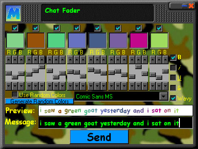

- Local: [assets/web-resources/methodus2000-com/fader.jpg](../../../assets/web-resources/methodus2000-com/fader.jpg)
- Source page: Methodus Toolz screenshots
- URL: [https://web.archive.org/web/20010119035500/http://www.methodus2000.com/methodustoolz/screenshots/fader.jpg](https://web.archive.org/web/20010119035500/http://www.methodus2000.com/methodustoolz/screenshots/fader.jpg)

### Phisher/Mass IMer

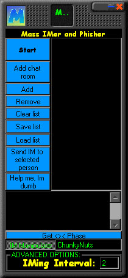

- Local: [assets/web-resources/methodus2000-com/phishmassim.jpg](../../../assets/web-resources/methodus2000-com/phishmassim.jpg)
- Source page: Methodus Toolz screenshots
- URL: [https://web.archive.org/web/20010119035500/http://www.methodus2000.com/methodustoolz/screenshots/phishmassim.jpg](https://web.archive.org/web/20010119035500/http://www.methodus2000.com/methodustoolz/screenshots/phishmassim.jpg)

### machumaine.jpg

- Local: [assets/web-resources/wipeout-hypermart-net/machumaine.jpg](../../../assets/web-resources/wipeout-hypermart-net/machumaine.jpg)
- Source page: FONTS
- URL: [https://web.archive.org/web/20010221025054im_/http://wipeout.hypermart.net/fonts/machumaine.jpg](https://web.archive.org/web/20010221025054im_/http://wipeout.hypermart.net/fonts/machumaine.jpg)

### screen_cct.gif

- Local: [assets/web-resources/coolkid-text2k-net/screen-cct.gif](../../../assets/web-resources/coolkid-text2k-net/screen-cct.gif)
- Source page: CoolKid CCT
- URL: [https://web.archive.org/web/20010428185554im_/http://coolkid.text2k.net/images/screen_cct.gif](https://web.archive.org/web/20010428185554im_/http://coolkid.text2k.net/images/screen_cct.gif)

### screen_qb.gif

- Local: [assets/web-resources/coolkid-text2k-net/screen-qb.gif](../../../assets/web-resources/coolkid-text2k-net/screen-qb.gif)
- Source page: QuickBust
- URL: [https://web.archive.org/web/20010428185859im_/http://coolkid.text2k.net/images/screen_qb.gif](https://web.archive.org/web/20010428185859im_/http://coolkid.text2k.net/images/screen_qb.gif)

### screen_v1.gif

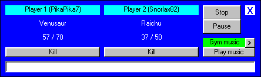

- Local: [assets/web-resources/coolkid-text2k-net/screen-v1.gif](../../../assets/web-resources/coolkid-text2k-net/screen-v1.gif)
- Source page: SuperPokémon!
- URL: [https://web.archive.org/web/20010429023955im_/http://coolkid.text2k.net/images/screen_v1.gif](https://web.archive.org/web/20010429023955im_/http://coolkid.text2k.net/images/screen_v1.gif)

### screen_v2.gif

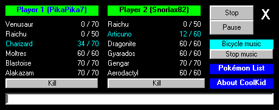

- Local: [assets/web-resources/coolkid-text2k-net/screen-v2.gif](../../../assets/web-resources/coolkid-text2k-net/screen-v2.gif)
- Source page: SuperPokémon!
- URL: [https://web.archive.org/web/20010429023955im_/http://coolkid.text2k.net/images/screen_v2.gif](https://web.archive.org/web/20010429023955im_/http://coolkid.text2k.net/images/screen_v2.gif)

### screenshot

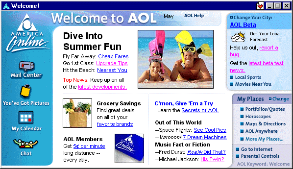

- Local: [assets/web-resources/freeprogz-com/aol7welcome.gif](../../../assets/web-resources/freeprogz-com/aol7welcome.gif)
- Source page: AIM 4.7 Beta Released, Check It Out!
- URL: [https://web.archive.org/web/20010516214202/http://www.freeprogz.com/aol7welcome.gif](https://web.archive.org/web/20010516214202/http://www.freeprogz.com/aol7welcome.gif)

### 1

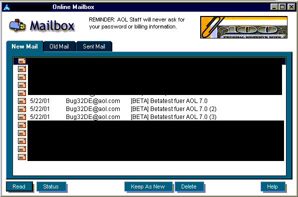

- Local: [assets/web-resources/freeprogz-com/aol7mail.gif](../../../assets/web-resources/freeprogz-com/aol7mail.gif)
- Source page: AIM 4.7 Beta Released, Check It Out!
- URL: [https://web.archive.org/web/20010516214202/http://www.freeprogz.com/aol7mail.gif](https://web.archive.org/web/20010516214202/http://www.freeprogz.com/aol7mail.gif)

### 2

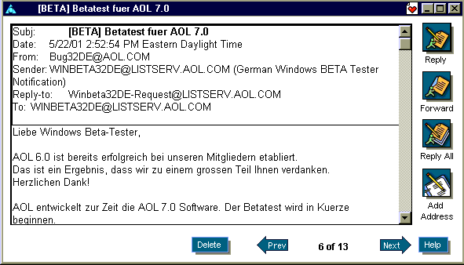

- Local: [assets/web-resources/freeprogz-com/aol7mail2.gif](../../../assets/web-resources/freeprogz-com/aol7mail2.gif)
- Source page: AIM 4.7 Beta Released, Check It Out!
- URL: [https://web.archive.org/web/20010516214202/http://www.freeprogz.com/aol7mail2.gif](https://web.archive.org/web/20010516214202/http://www.freeprogz.com/aol7mail2.gif)

### 3

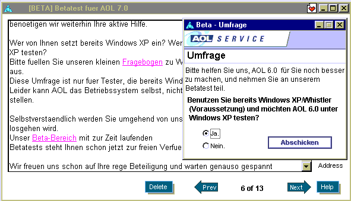

- Local: [assets/web-resources/freeprogz-com/aol7mail3.gif](../../../assets/web-resources/freeprogz-com/aol7mail3.gif)
- Source page: AIM 4.7 Beta Released, Check It Out!
- URL: [https://web.archive.org/web/20010516214202/http://www.freeprogz.com/aol7mail3.gif](https://web.archive.org/web/20010516214202/http://www.freeprogz.com/aol7mail3.gif)

### buddyicon1.jpg

- Local: [assets/web-resources/freeprogz-com/buddyicon1.jpg](../../../assets/web-resources/freeprogz-com/buddyicon1.jpg)
- Source page: AIM Secrets
- URL: [https://web.archive.org/web/20010613045907im_/http://www.freeprogz.com/buddyicon1.jpg](https://web.archive.org/web/20010613045907im_/http://www.freeprogz.com/buddyicon1.jpg)

### buddyicon17.jpg

- Local: [assets/web-resources/freeprogz-com/buddyicon17.jpg](../../../assets/web-resources/freeprogz-com/buddyicon17.jpg)
- Source page: AIM Secrets
- URL: [https://web.archive.org/web/20010613045907im_/http://www.freeprogz.com/buddyicon17.jpg](https://web.archive.org/web/20010613045907im_/http://www.freeprogz.com/buddyicon17.jpg)

### buddyicon5.gif

- Local: [assets/web-resources/freeprogz-com/buddyicon5.gif](../../../assets/web-resources/freeprogz-com/buddyicon5.gif)
- Source page: AIM Secrets
- URL: [https://web.archive.org/web/20010613045907im_/http://www.freeprogz.com/buddyicon5.gif](https://web.archive.org/web/20010613045907im_/http://www.freeprogz.com/buddyicon5.gif)

### buddyicon6.gif

- Local: [assets/web-resources/freeprogz-com/buddyicon6.gif](../../../assets/web-resources/freeprogz-com/buddyicon6.gif)
- Source page: AIM Secrets
- URL: [https://web.archive.org/web/20010613045907im_/http://www.freeprogz.com/buddyicon6.gif](https://web.archive.org/web/20010613045907im_/http://www.freeprogz.com/buddyicon6.gif)

### button.gif

- Local: [assets/web-resources/aimthings-com/button.gif](../../../assets/web-resources/aimthings-com/button.gif)
- Source page: Link Us
- URL: [https://web.archive.org/web/20030622100856im_/http://www.aimthings.com/images/button.gif](https://web.archive.org/web/20030622100856im_/http://www.aimthings.com/images/button.gif)

### button1.gif

- Local: [assets/web-resources/aimthings-com/button1.gif](../../../assets/web-resources/aimthings-com/button1.gif)
- Source page: Link Us
- URL: [https://web.archive.org/web/20030622100856im_/http://www.aimthings.com/images/button1.gif](https://web.archive.org/web/20030622100856im_/http://www.aimthings.com/images/button1.gif)

### button2.gif

- Local: [assets/web-resources/aimthings-com/button2.gif](../../../assets/web-resources/aimthings-com/button2.gif)
- Source page: Link Us
- URL: [https://web.archive.org/web/20030622100856im_/http://www.aimthings.com/images/button2.gif](https://web.archive.org/web/20030622100856im_/http://www.aimthings.com/images/button2.gif)

### Click

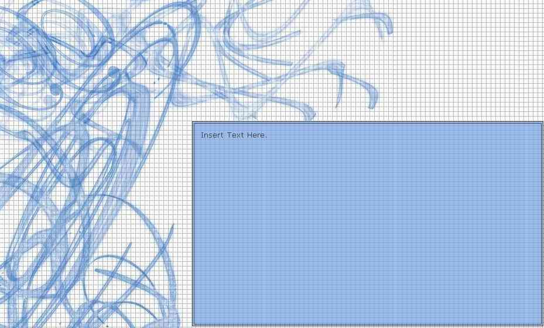

- Local: [assets/web-resources/lilbudbot-com/blue.jpg](../../../assets/web-resources/lilbudbot-com/blue.jpg)
- Source page: Free Layouts
- URL: [https://web.archive.org/web/20030622095131/http://www.lilbudbot.com/aimthings/layouts/blue.jpg](https://web.archive.org/web/20030622095131/http://www.lilbudbot.com/aimthings/layouts/blue.jpg)

### Click

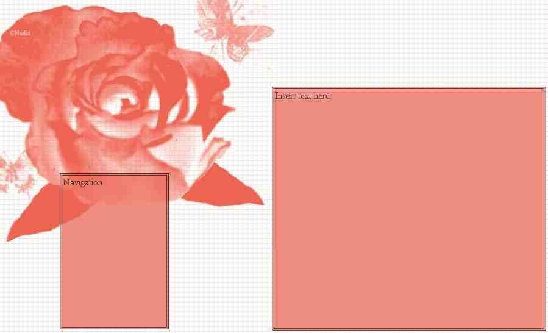

- Local: [assets/web-resources/lilbudbot-com/rose.jpg](../../../assets/web-resources/lilbudbot-com/rose.jpg)
- Source page: Free Layouts
- URL: [https://web.archive.org/web/20030622095131/http://www.lilbudbot.com/aimthings/layouts/rose.jpg](https://web.archive.org/web/20030622095131/http://www.lilbudbot.com/aimthings/layouts/rose.jpg)

### Click

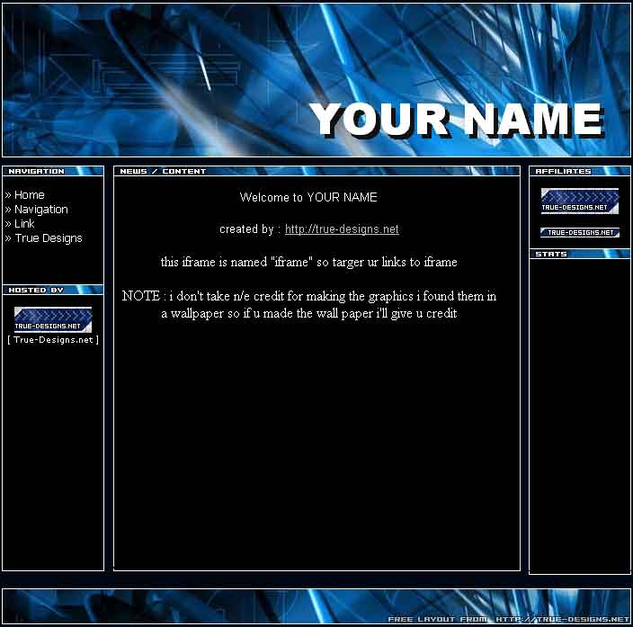

- Local: [assets/web-resources/lilbudbot-com/tentacles.jpg](../../../assets/web-resources/lilbudbot-com/tentacles.jpg)
- Source page: Free Layouts
- URL: [https://web.archive.org/web/20030622095131/http://www.lilbudbot.com/aimthings/layouts/tentacles.jpg](https://web.archive.org/web/20030622095131/http://www.lilbudbot.com/aimthings/layouts/tentacles.jpg)

### Click

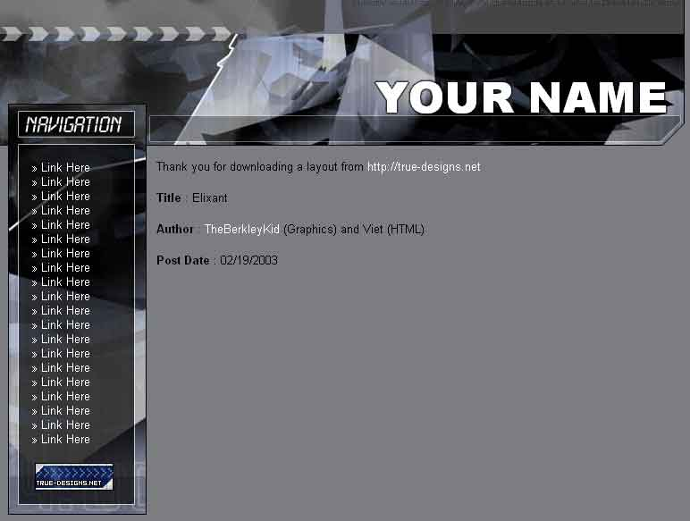

- Local: [assets/web-resources/lilbudbot-com/elixant.jpg](../../../assets/web-resources/lilbudbot-com/elixant.jpg)
- Source page: Free Layouts
- URL: [https://web.archive.org/web/20030622095131/http://www.lilbudbot.com/aimthings/layouts/elixant.jpg](https://web.archive.org/web/20030622095131/http://www.lilbudbot.com/aimthings/layouts/elixant.jpg)

### Click

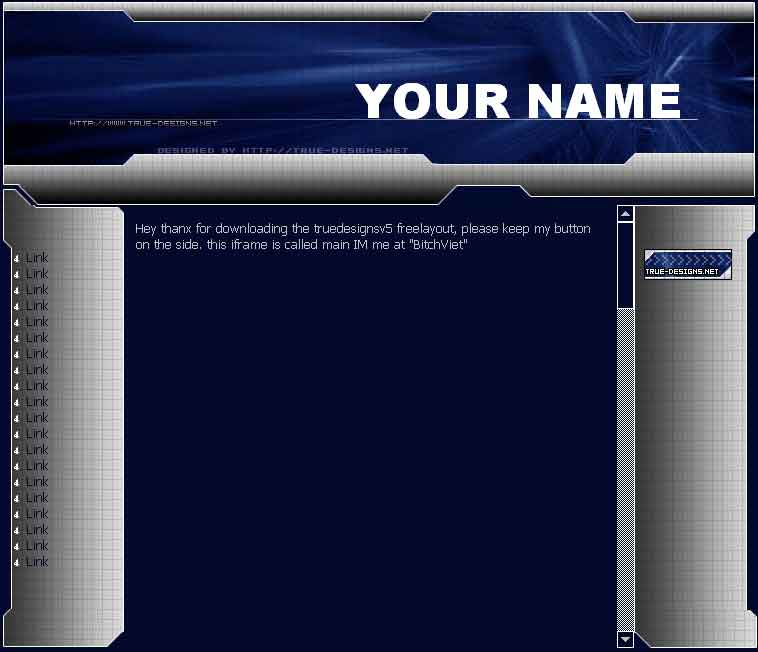

- Local: [assets/web-resources/lilbudbot-com/true.jpg](../../../assets/web-resources/lilbudbot-com/true.jpg)
- Source page: Free Layouts
- URL: [https://web.archive.org/web/20030622095131/http://www.lilbudbot.com/aimthings/layouts/true.jpg](https://web.archive.org/web/20030622095131/http://www.lilbudbot.com/aimthings/layouts/true.jpg)

### Click

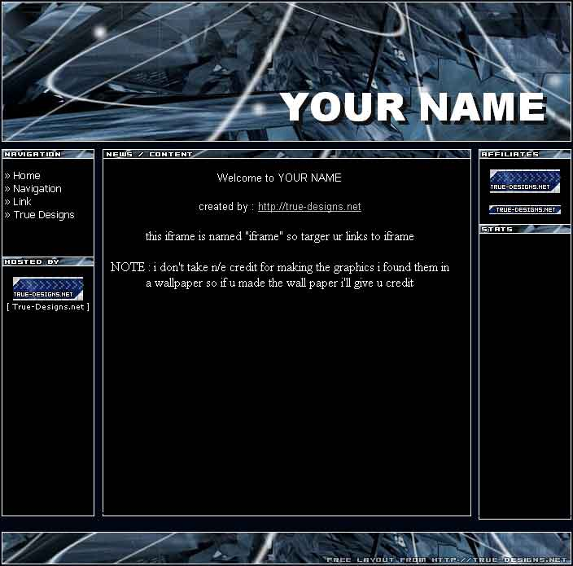

- Local: [assets/web-resources/lilbudbot-com/crazyhobo.jpg](../../../assets/web-resources/lilbudbot-com/crazyhobo.jpg)
- Source page: Free Layouts
- URL: [https://web.archive.org/web/20030622095131/http://www.lilbudbot.com/aimthings/layouts/crazyhobo.jpg](https://web.archive.org/web/20030622095131/http://www.lilbudbot.com/aimthings/layouts/crazyhobo.jpg)

### Click

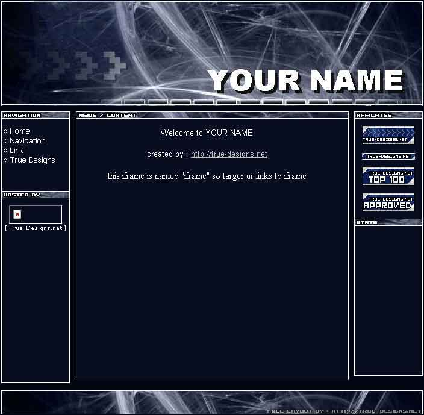

- Local: [assets/web-resources/lilbudbot-com/webby.jpg](../../../assets/web-resources/lilbudbot-com/webby.jpg)
- Source page: Free Layouts
- URL: [https://web.archive.org/web/20030622095131/http://www.lilbudbot.com/aimthings/layouts/webby.jpg](https://web.archive.org/web/20030622095131/http://www.lilbudbot.com/aimthings/layouts/webby.jpg)

### Click

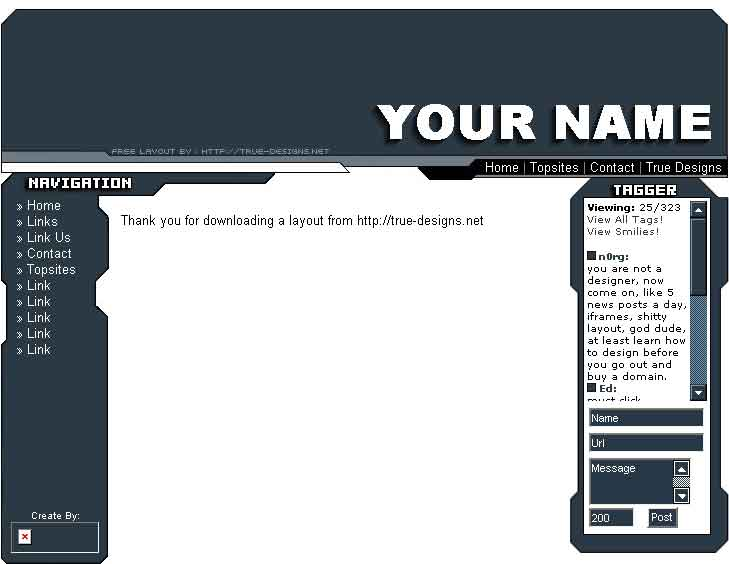

- Local: [assets/web-resources/lilbudbot-com/sleekgray.jpg](../../../assets/web-resources/lilbudbot-com/sleekgray.jpg)
- Source page: Free Layouts
- URL: [https://web.archive.org/web/20030622095131/http://www.lilbudbot.com/aimthings/layouts/sleekgray.jpg](https://web.archive.org/web/20030622095131/http://www.lilbudbot.com/aimthings/layouts/sleekgray.jpg)

### Click

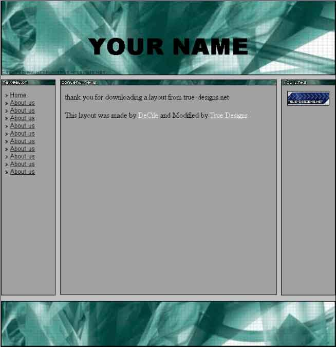

- Local: [assets/web-resources/lilbudbot-com/ct.jpg](../../../assets/web-resources/lilbudbot-com/ct.jpg)
- Source page: Free Layouts
- URL: [https://web.archive.org/web/20030622095131/http://www.lilbudbot.com/aimthings/layouts/ct.jpg](https://web.archive.org/web/20030622095131/http://www.lilbudbot.com/aimthings/layouts/ct.jpg)

### Click

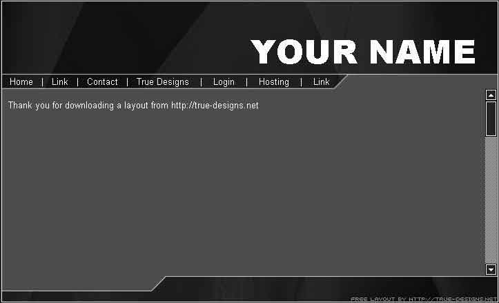

- Local: [assets/web-resources/lilbudbot-com/cookiemonster.jpg](../../../assets/web-resources/lilbudbot-com/cookiemonster.jpg)
- Source page: Free Layouts
- URL: [https://web.archive.org/web/20030622095131/http://www.lilbudbot.com/aimthings/layouts/cookiemonster.jpg](https://web.archive.org/web/20030622095131/http://www.lilbudbot.com/aimthings/layouts/cookiemonster.jpg)

### Click

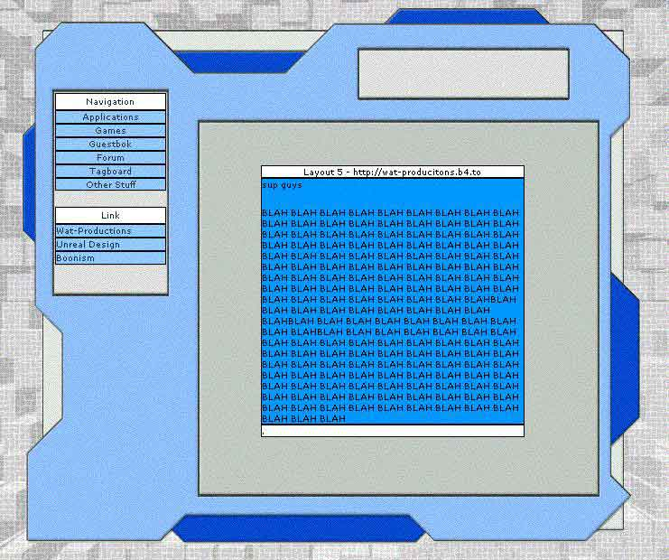

- Local: [assets/web-resources/lilbudbot-com/legos.jpg](../../../assets/web-resources/lilbudbot-com/legos.jpg)
- Source page: Free Layouts
- URL: [https://web.archive.org/web/20030622095131/http://www.lilbudbot.com/aimthings/layouts/legos.jpg](https://web.archive.org/web/20030622095131/http://www.lilbudbot.com/aimthings/layouts/legos.jpg)

### Click

- Local: [assets/web-resources/lilbudbot-com/redsparks.jpg](../../../assets/web-resources/lilbudbot-com/redsparks.jpg)
- Source page: Free Layouts
- URL: [https://web.archive.org/web/20030622095131/http://www.lilbudbot.com/aimthings/layouts/redsparks.jpg](https://web.archive.org/web/20030622095131/http://www.lilbudbot.com/aimthings/layouts/redsparks.jpg)

### Click

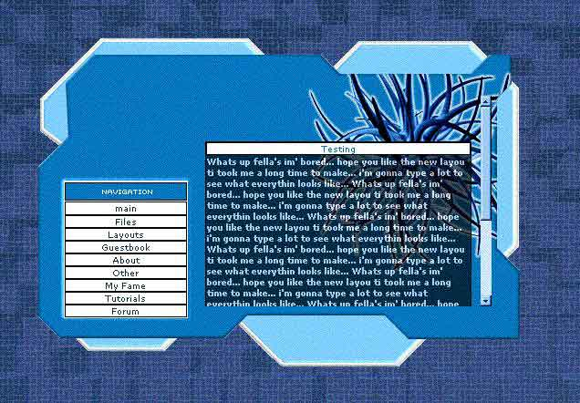

- Local: [assets/web-resources/lilbudbot-com/cinemablue.jpg](../../../assets/web-resources/lilbudbot-com/cinemablue.jpg)
- Source page: Free Layouts
- URL: [https://web.archive.org/web/20030622095131/http://www.lilbudbot.com/aimthings/layouts/cinemablue.jpg](https://web.archive.org/web/20030622095131/http://www.lilbudbot.com/aimthings/layouts/cinemablue.jpg)

### Click

- Local: [assets/web-resources/lilbudbot-com/nyc.jpg](../../../assets/web-resources/lilbudbot-com/nyc.jpg)
- Source page: Free Layouts
- URL: [https://web.archive.org/web/20030622095131/http://www.lilbudbot.com/aimthings/layouts/nyc.jpg](https://web.archive.org/web/20030622095131/http://www.lilbudbot.com/aimthings/layouts/nyc.jpg)

### Click

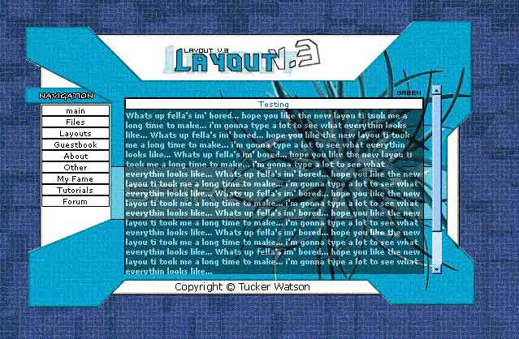

- Local: [assets/web-resources/lilbudbot-com/cinemagreen.jpg](../../../assets/web-resources/lilbudbot-com/cinemagreen.jpg)
- Source page: Free Layouts
- URL: [https://web.archive.org/web/20030622095131/http://www.lilbudbot.com/aimthings/layouts/cinemagreen.jpg](https://web.archive.org/web/20030622095131/http://www.lilbudbot.com/aimthings/layouts/cinemagreen.jpg)

### Click

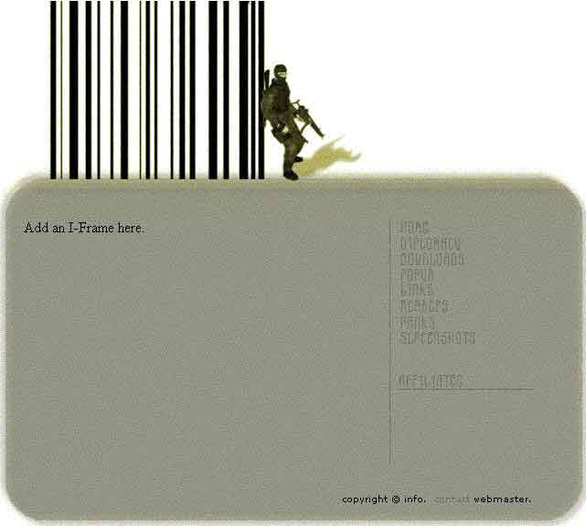

- Local: [assets/web-resources/lilbudbot-com/cs.jpg](../../../assets/web-resources/lilbudbot-com/cs.jpg)
- Source page: Free Layouts
- URL: [https://web.archive.org/web/20030622095131/http://www.lilbudbot.com/aimthings/layouts/cs.jpg](https://web.archive.org/web/20030622095131/http://www.lilbudbot.com/aimthings/layouts/cs.jpg)

### Click

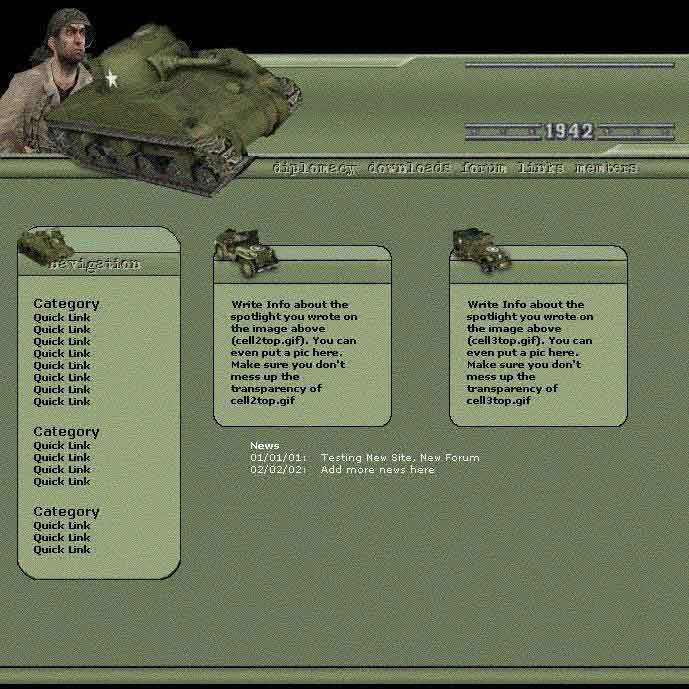

- Local: [assets/web-resources/lilbudbot-com/war.jpg](../../../assets/web-resources/lilbudbot-com/war.jpg)
- Source page: Free Layouts
- URL: [https://web.archive.org/web/20030622095131/http://www.lilbudbot.com/aimthings/layouts/war.jpg](https://web.archive.org/web/20030622095131/http://www.lilbudbot.com/aimthings/layouts/war.jpg)

### Click

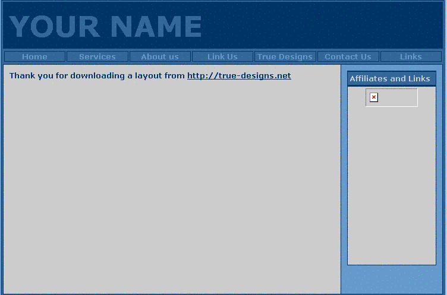

- Local: [assets/web-resources/lilbudbot-com/htmlonly-gif.gif](../../../assets/web-resources/lilbudbot-com/htmlonly-gif.gif)
- Source page: Free Layouts
- URL: [https://web.archive.org/web/20030622095131/http://www.lilbudbot.com/aimthings/layouts/htmlonly.GIF](https://web.archive.org/web/20030622095131/http://www.lilbudbot.com/aimthings/layouts/htmlonly.GIF)

### download.jpg

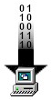

- Local: [assets/web-resources/oogle-net/download.jpg](../../../assets/web-resources/oogle-net/download.jpg)
- Source page: Oogle AIM progs
- URL: [https://web.archive.org/web/20010424150235im_/http://www.oogle.net/images/download.jpg](https://web.archive.org/web/20010424150235im_/http://www.oogle.net/images/download.jpg)

### em.gif

- Local: [assets/web-resources/aimthings-com/em.gif](../../../assets/web-resources/aimthings-com/em.gif)
- Source page: Contact
- URL: [https://web.archive.org/web/20030622093246im_/http://www.aimthings.com/images/em.gif](https://web.archive.org/web/20030622093246im_/http://www.aimthings.com/images/em.gif)

### freeprogztop100.jpg

- Local: [assets/web-resources/freeprogz-com/freeprogztop100.jpg](../../../assets/web-resources/freeprogz-com/freeprogztop100.jpg)
- Source page: FreeProgz links
- URL: [https://web.archive.org/web/20010603213502im_/http://www.freeprogz.com/freeprogztop100.jpg](https://web.archive.org/web/20010603213502im_/http://www.freeprogz.com/freeprogztop100.jpg)

### halthate.png

- Local: [assets/web-resources/freeprogz-com/halthate.png](../../../assets/web-resources/freeprogz-com/halthate.png)
- Source page: FreeProgz links
- URL: [https://web.archive.org/web/20010603213502im_/http://www.freeprogz.com/halthate.png](https://web.archive.org/web/20010603213502im_/http://www.freeprogz.com/halthate.png)

### help

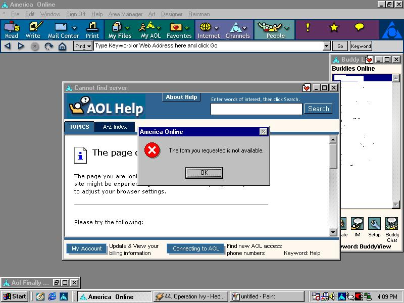

- Local: [assets/web-resources/freeprogz-com/hackedkeywords.jpg](../../../assets/web-resources/freeprogz-com/hackedkeywords.jpg)
- Source page: AIM 4.7 Beta Released, Check It Out!
- URL: [https://web.archive.org/web/20010516214202/http://www.freeprogz.com/hackedkeywords.jpg](https://web.archive.org/web/20010516214202/http://www.freeprogz.com/hackedkeywords.jpg)

### im.gif

- Local: [assets/web-resources/aimthings-com/im.gif](../../../assets/web-resources/aimthings-com/im.gif)
- Source page: Contact
- URL: [https://web.archive.org/web/20030622093246im_/http://www.aimthings.com/images/im.gif](https://web.archive.org/web/20030622093246im_/http://www.aimthings.com/images/im.gif)

### layout_03.gif

- Local: [assets/web-resources/aimthings-com/layout-03.gif](../../../assets/web-resources/aimthings-com/layout-03.gif)
- Source page: AimThings
- URL: [https://web.archive.org/web/20030623040448im_/http://aimthings.com/images1/layout_03.gif](https://web.archive.org/web/20030623040448im_/http://aimthings.com/images1/layout_03.gif)

### layout_05.gif

- Local: [assets/web-resources/aimthings-com/layout-05.gif](../../../assets/web-resources/aimthings-com/layout-05.gif)
- Source page: AimThings
- URL: [https://web.archive.org/web/20030623040448im_/http://aimthings.com/images1/layout_05.gif](https://web.archive.org/web/20030623040448im_/http://aimthings.com/images1/layout_05.gif)

### layout_06.gif

- Local: [assets/web-resources/aimthings-com/layout-06.gif](../../../assets/web-resources/aimthings-com/layout-06.gif)
- Source page: AimThings
- URL: [https://web.archive.org/web/20030623040448im_/http://aimthings.com/images1/layout_06.gif](https://web.archive.org/web/20030623040448im_/http://aimthings.com/images1/layout_06.gif)

### layout_07.gif

- Local: [assets/web-resources/aimthings-com/layout-07.gif](../../../assets/web-resources/aimthings-com/layout-07.gif)
- Source page: AimThings
- URL: [https://web.archive.org/web/20030623040448im_/http://aimthings.com/images1/layout_07.gif](https://web.archive.org/web/20030623040448im_/http://aimthings.com/images1/layout_07.gif)

### layout_10.gif

- Local: [assets/web-resources/aimthings-com/layout-10.gif](../../../assets/web-resources/aimthings-com/layout-10.gif)
- Source page: AimThings
- URL: [https://web.archive.org/web/20030623040448im_/http://aimthings.com/images1/layout_10.gif](https://web.archive.org/web/20030623040448im_/http://aimthings.com/images1/layout_10.gif)

### layout_11.gif

- Local: [assets/web-resources/aimthings-com/layout-11.gif](../../../assets/web-resources/aimthings-com/layout-11.gif)
- Source page: AimThings
- URL: [https://web.archive.org/web/20030623040448im_/http://aimthings.com/images1/layout_11.gif](https://web.archive.org/web/20030623040448im_/http://aimthings.com/images1/layout_11.gif)

### layout_12.gif

- Local: [assets/web-resources/aimthings-com/layout-12.gif](../../../assets/web-resources/aimthings-com/layout-12.gif)
- Source page: AimThings
- URL: [https://web.archive.org/web/20030623040448im_/http://aimthings.com/images1/layout_12.gif](https://web.archive.org/web/20030623040448im_/http://aimthings.com/images1/layout_12.gif)

### layout_13.gif

- Local: [assets/web-resources/aimthings-com/layout-13.gif](../../../assets/web-resources/aimthings-com/layout-13.gif)
- Source page: AimThings
- URL: [https://web.archive.org/web/20030623040448im_/http://aimthings.com/images1/layout_13.gif](https://web.archive.org/web/20030623040448im_/http://aimthings.com/images1/layout_13.gif)

### layout_15.gif

- Local: [assets/web-resources/aimthings-com/layout-15.gif](../../../assets/web-resources/aimthings-com/layout-15.gif)
- Source page: AimThings
- URL: [https://web.archive.org/web/20030623040448im_/http://aimthings.com/images1/layout_15.gif](https://web.archive.org/web/20030623040448im_/http://aimthings.com/images1/layout_15.gif)

### layout_16.gif

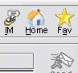

- Local: [assets/web-resources/aimthings-com/layout-16.gif](../../../assets/web-resources/aimthings-com/layout-16.gif)
- Source page: AimThings
- URL: [https://web.archive.org/web/20030623040448im_/http://aimthings.com/images1/layout_16.gif](https://web.archive.org/web/20030623040448im_/http://aimthings.com/images1/layout_16.gif)

### layout_17.gif

- Local: [assets/web-resources/aimthings-com/layout-17.gif](../../../assets/web-resources/aimthings-com/layout-17.gif)
- Source page: AimThings
- URL: [https://web.archive.org/web/20030623040448im_/http://aimthings.com/images1/layout_17.gif](https://web.archive.org/web/20030623040448im_/http://aimthings.com/images1/layout_17.gif)

### layout_19.gif

- Local: [assets/web-resources/aimthings-com/layout-19.gif](../../../assets/web-resources/aimthings-com/layout-19.gif)
- Source page: AimThings
- URL: [https://web.archive.org/web/20030623040448im_/http://aimthings.com/images1/layout_19.gif](https://web.archive.org/web/20030623040448im_/http://aimthings.com/images1/layout_19.gif)

### line.jpg

- Local: [assets/web-resources/oogle-net/line.jpg](../../../assets/web-resources/oogle-net/line.jpg)
- Source page: Oogle AIM progs
- URL: [https://web.archive.org/web/20010424150235im_/http://www.oogle.net/images/line.jpg](https://web.archive.org/web/20010424150235im_/http://www.oogle.net/images/line.jpg)

### side.gif

- Local: [assets/web-resources/freeprogz-com/side.gif](../../../assets/web-resources/freeprogz-com/side.gif)
- Source page: FreeProgz main
- URL: [https://web.archive.org/web/20010516214202im_/http://www.freeprogz.com/side.gif](https://web.archive.org/web/20010516214202im_/http://www.freeprogz.com/side.gif)

### spacer.gif

- Local: [assets/web-resources/aimthings-com/spacer.gif](../../../assets/web-resources/aimthings-com/spacer.gif)
- Source page: AimThings
- URL: [https://web.archive.org/web/20030623040448im_/http://aimthings.com/images1/spacer.gif](https://web.archive.org/web/20030623040448im_/http://aimthings.com/images1/spacer.gif)

### top.gif

- Local: [assets/web-resources/freeprogz-com/top.gif](../../../assets/web-resources/freeprogz-com/top.gif)
- Source page: FreeProgz main
- URL: [https://web.archive.org/web/20010516214202im_/http://www.freeprogz.com/top.gif](https://web.archive.org/web/20010516214202im_/http://www.freeprogz.com/top.gif)

### TS.gif

- Local: [assets/web-resources/8op-com/ts.gif](../../../assets/web-resources/8op-com/ts.gif)
- Source page: RiceJerry links
- URL: [https://web.archive.org/web/20010223212351im_/http://www.8op.com/amoxapine/images/TS.gif](https://web.archive.org/web/20010223212351im_/http://www.8op.com/amoxapine/images/TS.gif)

### 1979.jpg

- Local: [assets/web-resources/wipeout-hypermart-net/1979.jpg](../../../assets/web-resources/wipeout-hypermart-net/1979.jpg)
- Source page: FONTS
- URL: [https://web.archive.org/web/20010221025054im_/http://wipeout.hypermart.net/fonts/1979.jpg](https://web.archive.org/web/20010221025054im_/http://wipeout.hypermart.net/fonts/1979.jpg)

### 01-normal-vs-patched-token-flow.png

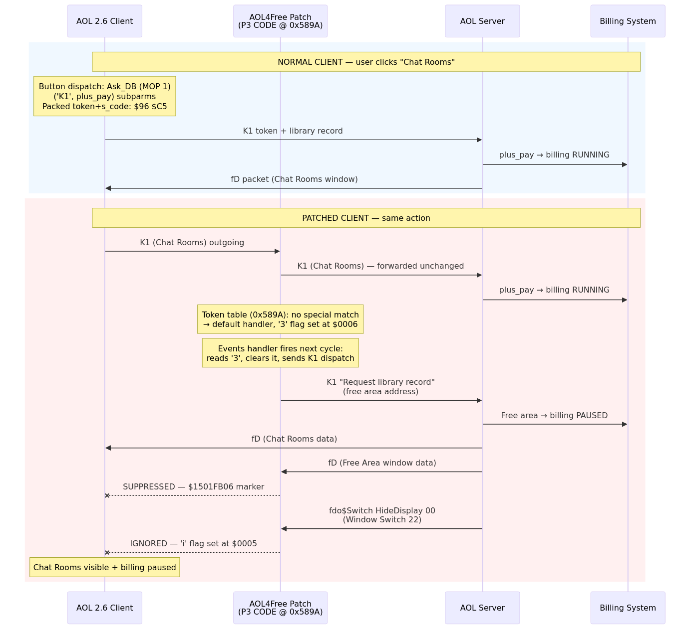

- Local: [assets/web-resources/github-com/01-normal-vs-patched-token-flow.png](../../../assets/web-resources/github-com/01-normal-vs-patched-token-flow.png)
- Source page: AOL4Free v4
- URL: [https://github.com/mikrodotnet/aol-progz/raw/main/programs/Mac/hells/aol4free/diagrams/01-normal-vs-patched-token-flow.png](https://github.com/mikrodotnet/aol-progz/raw/main/programs/Mac/hells/aol4free/diagrams/01-normal-vs-patched-token-flow.png)

### 02-v4-stealth-signon.png

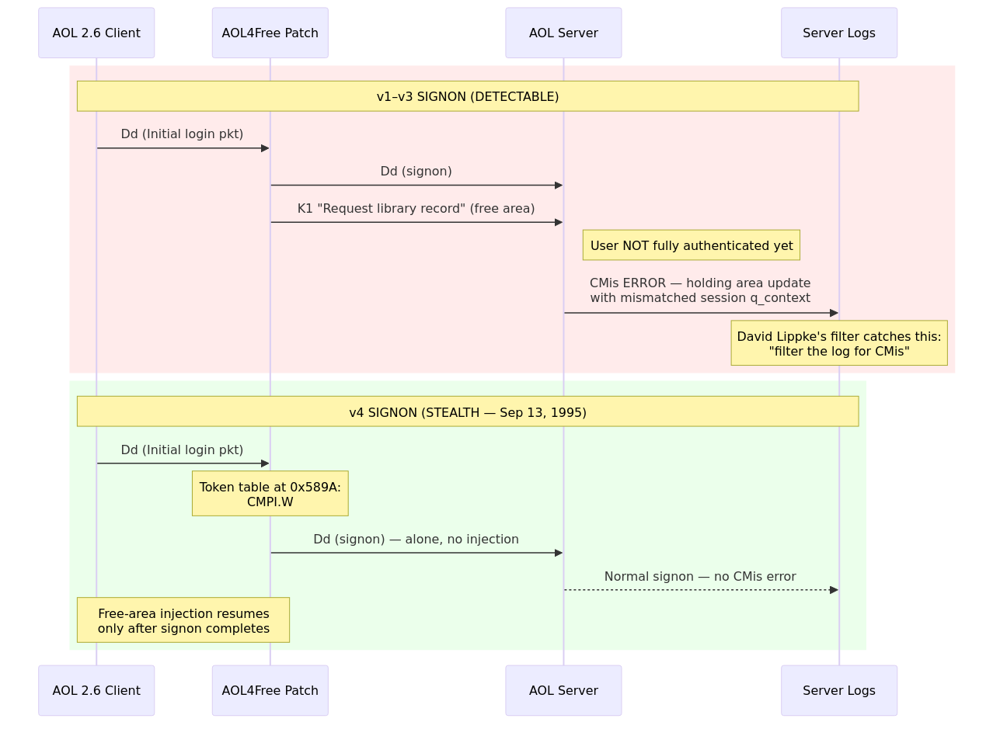

- Local: [assets/web-resources/github-com/02-v4-stealth-signon.png](../../../assets/web-resources/github-com/02-v4-stealth-signon.png)
- Source page: AOL4Free v4
- URL: [https://github.com/mikrodotnet/aol-progz/raw/main/programs/Mac/hells/aol4free/diagrams/02-v4-stealth-signon.png](https://github.com/mikrodotnet/aol-progz/raw/main/programs/Mac/hells/aol4free/diagrams/02-v4-stealth-signon.png)

### 03-token-dispatch-table.png

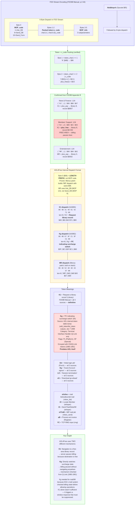

- Local: [assets/web-resources/github-com/03-token-dispatch-table.png](../../../assets/web-resources/github-com/03-token-dispatch-table.png)
- Source page: AOL4Free v4
- URL: [https://github.com/mikrodotnet/aol-progz/raw/main/programs/Mac/hells/aol4free/diagrams/03-token-dispatch-table.png](https://github.com/mikrodotnet/aol-progz/raw/main/programs/Mac/hells/aol4free/diagrams/03-token-dispatch-table.png)

### 04-patch-architecture.png

- Local: [assets/web-resources/github-com/04-patch-architecture.png](../../../assets/web-resources/github-com/04-patch-architecture.png)
- Source page: AOL4Free v4
- URL: [https://github.com/mikrodotnet/aol-progz/raw/main/programs/Mac/hells/aol4free/diagrams/04-patch-architecture.png](https://github.com/mikrodotnet/aol-progz/raw/main/programs/Mac/hells/aol4free/diagrams/04-patch-architecture.png)

### 05-three-injection-mechanisms.png

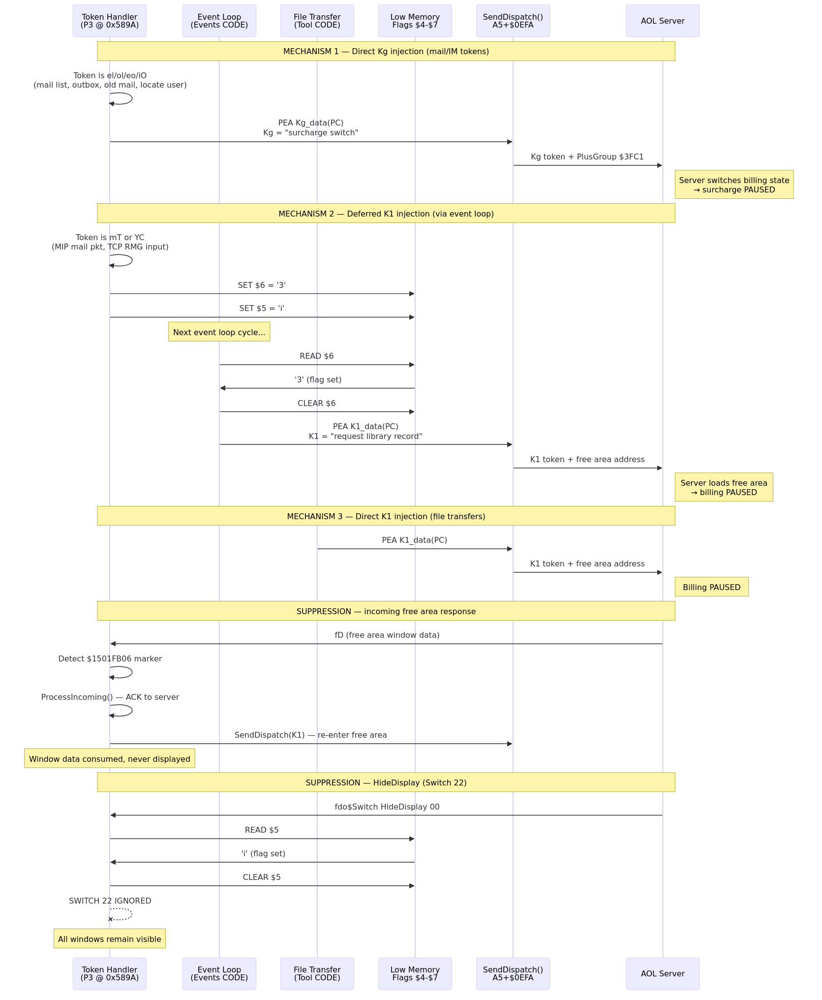

- Local: [assets/web-resources/github-com/05-three-injection-mechanisms.png](../../../assets/web-resources/github-com/05-three-injection-mechanisms.png)
- Source page: AOL4Free v4
- URL: [https://github.com/mikrodotnet/aol-progz/raw/main/programs/Mac/hells/aol4free/diagrams/05-three-injection-mechanisms.png](https://github.com/mikrodotnet/aol-progz/raw/main/programs/Mac/hells/aol4free/diagrams/05-three-injection-mechanisms.png)

### 06-aol-protocol-exploit.png

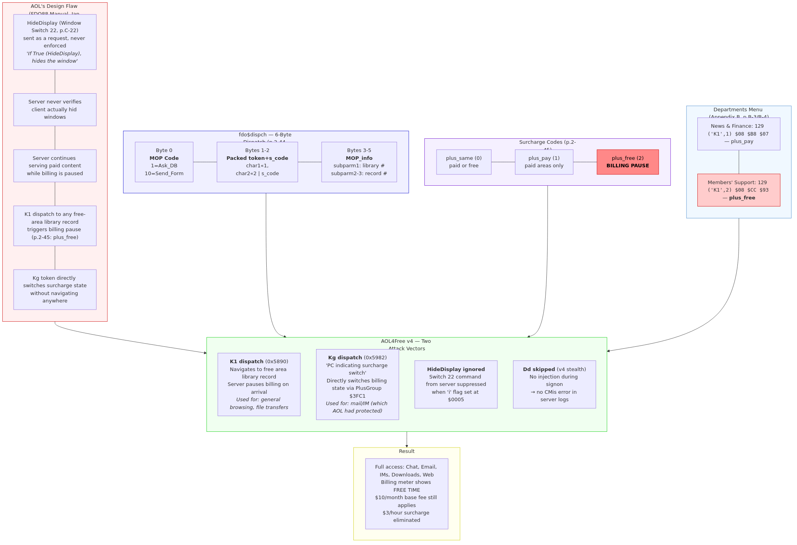

- Local: [assets/web-resources/github-com/06-aol-protocol-exploit.png](../../../assets/web-resources/github-com/06-aol-protocol-exploit.png)
- Source page: AOL4Free v4
- URL: [https://github.com/mikrodotnet/aol-progz/raw/main/programs/Mac/hells/aol4free/diagrams/06-aol-protocol-exploit.png](https://github.com/mikrodotnet/aol-progz/raw/main/programs/Mac/hells/aol4free/diagrams/06-aol-protocol-exploit.png)

### 07-version-history-detection.png

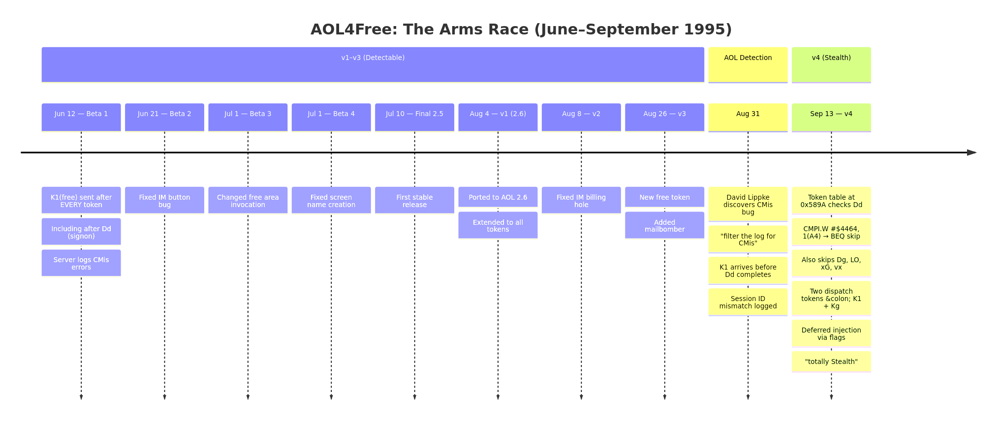

- Local: [assets/web-resources/github-com/07-version-history-detection.png](../../../assets/web-resources/github-com/07-version-history-detection.png)
- Source page: AOL4Free v4
- URL: [https://github.com/mikrodotnet/aol-progz/raw/main/programs/Mac/hells/aol4free/diagrams/07-version-history-detection.png](https://github.com/mikrodotnet/aol-progz/raw/main/programs/Mac/hells/aol4free/diagrams/07-version-history-detection.png)

### 08-memory-map.png

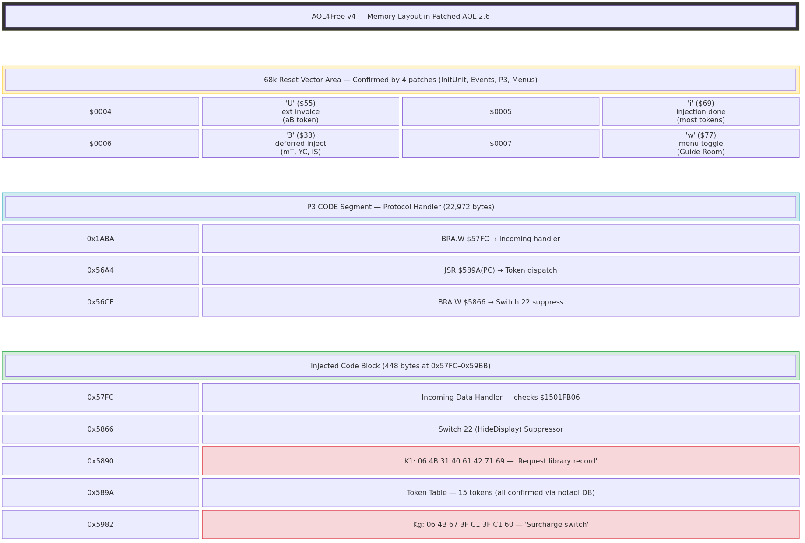

- Local: [assets/web-resources/github-com/08-memory-map.png](../../../assets/web-resources/github-com/08-memory-map.png)
- Source page: AOL4Free v4
- URL: [https://github.com/mikrodotnet/aol-progz/raw/main/programs/Mac/hells/aol4free/diagrams/08-memory-map.png](https://github.com/mikrodotnet/aol-progz/raw/main/programs/Mac/hells/aol4free/diagrams/08-memory-map.png)

### 09-fdo88-dispatch-encoding.png

- Local: [assets/web-resources/github-com/09-fdo88-dispatch-encoding.png](../../../assets/web-resources/github-com/09-fdo88-dispatch-encoding.png)
- Source page: AOL4Free v4
- URL: [https://github.com/mikrodotnet/aol-progz/raw/main/programs/Mac/hells/aol4free/diagrams/09-fdo88-dispatch-encoding.png](https://github.com/mikrodotnet/aol-progz/raw/main/programs/Mac/hells/aol4free/diagrams/09-fdo88-dispatch-encoding.png)

### 8AB%20is%20an%20unconditional%20jump%20to%20the%20patch%20at%20the%20end%20of%20the%20resource.png

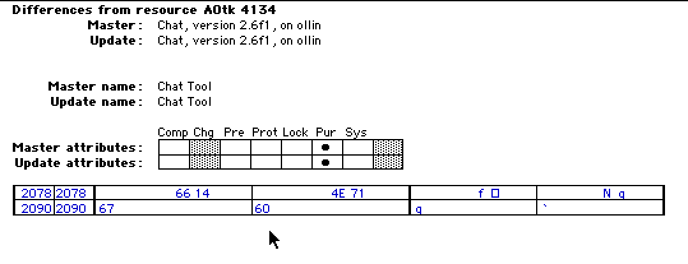

- Local: [assets/web-resources/github-com/8ab20is20an20unconditional20jump20to20the20patch20at20the20end20of20the20resource.png](../../../assets/web-resources/github-com/8ab20is20an20unconditional20jump20to20the20patch20at20the20end20of20the20resource.png)
- Source page: AOL4Free v4
- URL: [https://github.com/mikrodotnet/aol-progz/raw/main/programs/Mac/hells/aol4free/screenshots/8AB%20is%20an%20unconditional%20jump%20to%20the%20patch%20at%20the%20end%20of%20the%20resource.png](https://github.com/mikrodotnet/aol-progz/raw/main/programs/Mac/hells/aol4free/screenshots/8AB%20is%20an%20unconditional%20jump%20to%20the%20patch%20at%20the%20end%20of%20the%20resource.png)

### aolv2.6_patched_with_aol4free.png

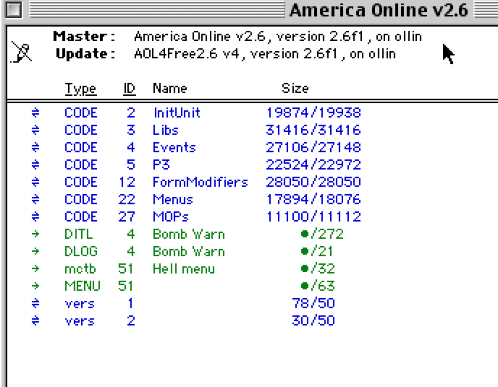

- Local: [assets/web-resources/github-com/aolv2-6-patched-with-aol4free.png](../../../assets/web-resources/github-com/aolv2-6-patched-with-aol4free.png)
- Source page: AOL4Free v4
- URL: [https://github.com/mikrodotnet/aol-progz/raw/main/programs/Mac/hells/aol4free/screenshots/aolv2.6_patched_with_aol4free.png](https://github.com/mikrodotnet/aol-progz/raw/main/programs/Mac/hells/aol4free/screenshots/aolv2.6_patched_with_aol4free.png)

### https://github.com/mikrodotnet/aol-progz/blob/main/programs/Mac/hells/aol4free/diagrams/01-normal-vs-patched-token-flow.png

- Local: [assets/web-resources/github-com/01-normal-vs-patched-token-flow.png](../../../assets/web-resources/github-com/01-normal-vs-patched-token-flow.png)
- Source page: AOL4Free v4
- URL: [https://github.com/mikrodotnet/aol-progz/blob/main/programs/Mac/hells/aol4free/diagrams/01-normal-vs-patched-token-flow.png](https://github.com/mikrodotnet/aol-progz/blob/main/programs/Mac/hells/aol4free/diagrams/01-normal-vs-patched-token-flow.png)

### https://github.com/mikrodotnet/aol-progz/blob/main/programs/Mac/hells/aol4free/diagrams/02-v4-stealth-signon.png

- Local: [assets/web-resources/github-com/02-v4-stealth-signon.png](../../../assets/web-resources/github-com/02-v4-stealth-signon.png)
- Source page: AOL4Free v4
- URL: [https://github.com/mikrodotnet/aol-progz/blob/main/programs/Mac/hells/aol4free/diagrams/02-v4-stealth-signon.png](https://github.com/mikrodotnet/aol-progz/blob/main/programs/Mac/hells/aol4free/diagrams/02-v4-stealth-signon.png)

### https://github.com/mikrodotnet/aol-progz/blob/main/programs/Mac/hells/aol4free/diagrams/03-token-dispatch-table.png

- Local: [assets/web-resources/github-com/03-token-dispatch-table.png](../../../assets/web-resources/github-com/03-token-dispatch-table.png)
- Source page: AOL4Free v4
- URL: [https://github.com/mikrodotnet/aol-progz/blob/main/programs/Mac/hells/aol4free/diagrams/03-token-dispatch-table.png](https://github.com/mikrodotnet/aol-progz/blob/main/programs/Mac/hells/aol4free/diagrams/03-token-dispatch-table.png)

### https://github.com/mikrodotnet/aol-progz/blob/main/programs/Mac/hells/aol4free/diagrams/04-patch-architecture.png

- Local: [assets/web-resources/github-com/04-patch-architecture.png](../../../assets/web-resources/github-com/04-patch-architecture.png)
- Source page: AOL4Free v4
- URL: [https://github.com/mikrodotnet/aol-progz/blob/main/programs/Mac/hells/aol4free/diagrams/04-patch-architecture.png](https://github.com/mikrodotnet/aol-progz/blob/main/programs/Mac/hells/aol4free/diagrams/04-patch-architecture.png)

### https://github.com/mikrodotnet/aol-progz/blob/main/programs/Mac/hells/aol4free/diagrams/05-three-injection-mechanisms.png

- Local: [assets/web-resources/github-com/05-three-injection-mechanisms.png](../../../assets/web-resources/github-com/05-three-injection-mechanisms.png)
- Source page: AOL4Free v4
- URL: [https://github.com/mikrodotnet/aol-progz/blob/main/programs/Mac/hells/aol4free/diagrams/05-three-injection-mechanisms.png](https://github.com/mikrodotnet/aol-progz/blob/main/programs/Mac/hells/aol4free/diagrams/05-three-injection-mechanisms.png)

### https://github.com/mikrodotnet/aol-progz/blob/main/programs/Mac/hells/aol4free/diagrams/06-aol-protocol-exploit.png

- Local: [assets/web-resources/github-com/06-aol-protocol-exploit.png](../../../assets/web-resources/github-com/06-aol-protocol-exploit.png)
- Source page: AOL4Free v4
- URL: [https://github.com/mikrodotnet/aol-progz/blob/main/programs/Mac/hells/aol4free/diagrams/06-aol-protocol-exploit.png](https://github.com/mikrodotnet/aol-progz/blob/main/programs/Mac/hells/aol4free/diagrams/06-aol-protocol-exploit.png)

### https://github.com/mikrodotnet/aol-progz/blob/main/programs/Mac/hells/aol4free/diagrams/07-version-history-detection.png

- Local: [assets/web-resources/github-com/07-version-history-detection.png](../../../assets/web-resources/github-com/07-version-history-detection.png)
- Source page: AOL4Free v4
- URL: [https://github.com/mikrodotnet/aol-progz/blob/main/programs/Mac/hells/aol4free/diagrams/07-version-history-detection.png](https://github.com/mikrodotnet/aol-progz/blob/main/programs/Mac/hells/aol4free/diagrams/07-version-history-detection.png)

### https://github.com/mikrodotnet/aol-progz/blob/main/programs/Mac/hells/aol4free/diagrams/08-memory-map.png

- Local: [assets/web-resources/github-com/08-memory-map.png](../../../assets/web-resources/github-com/08-memory-map.png)
- Source page: AOL4Free v4
- URL: [https://github.com/mikrodotnet/aol-progz/blob/main/programs/Mac/hells/aol4free/diagrams/08-memory-map.png](https://github.com/mikrodotnet/aol-progz/blob/main/programs/Mac/hells/aol4free/diagrams/08-memory-map.png)

### https://github.com/mikrodotnet/aol-progz/blob/main/programs/Mac/hells/aol4free/diagrams/09-fdo88-dispatch-encoding.png

- Local: [assets/web-resources/github-com/09-fdo88-dispatch-encoding.png](../../../assets/web-resources/github-com/09-fdo88-dispatch-encoding.png)
- Source page: AOL4Free v4
- URL: [https://github.com/mikrodotnet/aol-progz/blob/main/programs/Mac/hells/aol4free/diagrams/09-fdo88-dispatch-encoding.png](https://github.com/mikrodotnet/aol-progz/blob/main/programs/Mac/hells/aol4free/diagrams/09-fdo88-dispatch-encoding.png)

- [All web image attempts](web-images.md)
