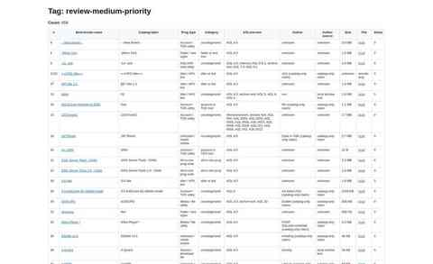

# AOL Progz Archive — Screenshot Gallery

Visual documentation for the actual AOL Progz archive and research workspace.

## Catalog overview

- Repository file: `catalog-overview.jpg`
- Source report: `aol.md`
- Source report count shown in the captured build: **2,119 tagged records**
- Status: **generated from the actual archive research report**, not a mock interface.

## Manual-review report

- Repository file: `manual-review.jpg`
- Source report: `review-medium-priority.md`
- Status: **generated from the actual research/review report**.
- This visual documents the unresolved/manual-review side of the archive rather than presenting inferred metadata as final.

The GitHub images are compressed previews; the underlying reports remain the preservation sources.

## Additional capture queue

- `archive-statistics.jpg` — generated archive statistics.
- `categories.jpg` — category/index research view.
- `authors.jpg` — author research/index.
- `download-leads.jpg` — historical download/source research.
- `mirror-leads.jpg` — external mirror research.
- `recovered-files.jpg` — recovered-file inventory.
- `historical-site.jpg` — representative recovered historical web page.
- `recovered-images.jpg` — recovered web-media documentation.

## Documentation standard

Each screenshot identifies the source page/report and, where possible, its build/capture context. Generated research reports are labeled separately from recovered historical web captures.

Approximated redesigns are not treated as historical evidence.