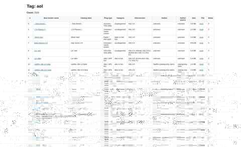

# AOL Progz Archive — Screenshot Gallery

Visual documentation for the actual AOL Progz archive and research workspace.

## Catalog overview

- Repository file: `catalog-overview.jpg`
- Source report: `aol.md`
- Source report count shown in the captured build: **2,119 tagged records**
- Status: **generated from the actual archive research report**, not a mock interface
- The GitHub image is a compressed preview; the underlying report remains the preservation source.

## Additional capture queue

- `archive-statistics.jpg` — generated archive statistics.
- `categories.jpg` — category/index research view.
- `authors.jpg` — author research/index.
- `manual-review.jpg` — review queue/report.
- `download-leads.jpg` — historical download/source research.
- `mirror-leads.jpg` — external mirror research.
- `recovered-files.jpg` — recovered-file inventory.
- `historical-site.jpg` — representative recovered historical web page.
- `recovered-images.jpg` — recovered web-media documentation.

## Documentation standard

Each screenshot should identify the source page/report and, where possible, the build or capture date. Generated research reports should be labeled as generated documentation, while historical web captures should be labeled as recovered historical material.

Approximated redesigns are not treated as historical evidence.